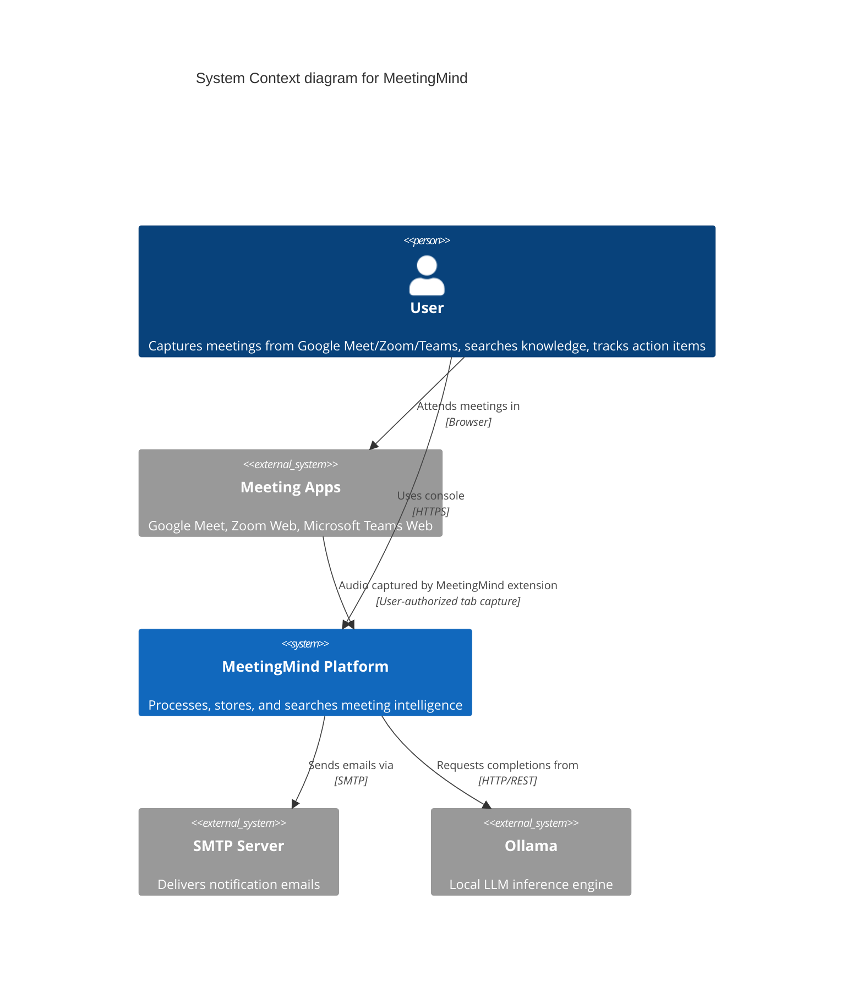
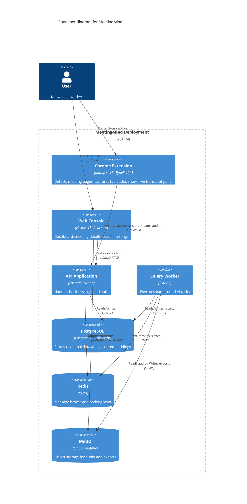
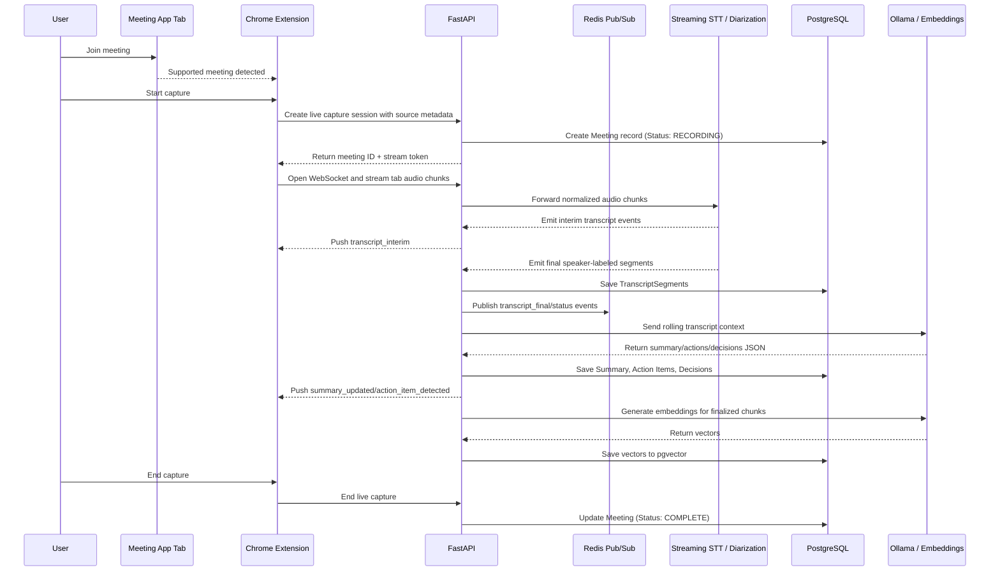

# MeetingMind — Architecture Overview

This document provides a high-level overview of the MeetingMind system architecture, detailing the components, their interactions, data flows, and the rationale behind critical technical decisions.

## 1. System Context (C4 Level 1)

MeetingMind operates primarily within the host organization's infrastructure. The Chrome extension runs in the user's browser as the capture client and streams authorized meeting audio to the self-hosted backend.

## 2. Container Diagram (C4 Level 2)

The system is designed as a modular monolith utilizing background workers for heavy processing.

## 3. Core Architectural Decisions & Rationale

### 3.1. Frontend: Next.js 15 App Router
* **Rationale:** Provides React Server Components for optimized data fetching, strong typing across boundaries, and excellent ecosystem support (shadcn/ui, Tailwind).
* **Trade-off:** Steeper learning curve compared to standard React SPAs, but necessary for complex state and routing requirements.

### 3.2. Backend: FastAPI (Python)
* **Rationale:** Python is the lingua franca of AI/ML. Using FastAPI allows seamless integration with LangChain, Whisper, and PyTorch libraries while maintaining high performance (asyncio) and auto-generating OpenAPI documentation.
* **Trade-off:** GIL constraints require running multiple Uvicorn workers and utilizing Celery for CPU-bound tasks.

### 3.3. Database: PostgreSQL + pgvector
* **Rationale:** Instead of running a separate vector database (like Qdrant or Pinecone) and maintaining consistency with a relational database, `pgvector` allows us to store embeddings alongside the source data (transcripts). This radically simplifies the architecture and ensures ACID compliance.
* **Trade-off:** Not as scalable as dedicated vector databases at >10M vectors, but more than sufficient for v1/v2 workloads.

### 3.4. Background Processing: Celery + Redis
* **Rationale:** Audio extraction and transcription are long-running, CPU-heavy tasks that will block HTTP threads. Celery is the Python standard for robust, distributed task queuing with built-in retry mechanisms.

### 3.5. Object Storage: MinIO
* **Rationale:** Meeting audio files can be large (GBs). Storing them in a database is an anti-pattern. MinIO provides an S3-compatible API that runs locally, preserving data sovereignty while allowing easy migration to AWS S3 if an organization decides to move to the cloud.

---

## 4. Primary Data Flows

### 4.1. Extension-Based Real-Time Meeting Capture and Processing Pipeline

Recording imports use the same transcript, analysis, embedding, and storage model after a presigned upload and Celery batch ingestion step. They are a fallback path, not the primary v1 workflow.

### 4.2. Semantic Search (RAG) Flow

1. User enters a query ("What did we decide about the new auth flow?").
2. FastAPI generates a vector embedding for the query using the local embedding model.
3. FastAPI queries PostgreSQL (pgvector) for the closest matching transcript chunks using Cosine Similarity + BM25 (Hybrid Search).
4. Top 10 chunks are retrieved.
5. FastAPI constructs a prompt containing the retrieved chunks and the user's query.
6. The prompt is sent to the local LLM (Llama 3) via Ollama.
7. The LLM generates an answer with citations back to the source chunks.
8. The response is streamed back to the frontend.

---

## 5. Scalability & Failure Modes

### Scalability Path
The architecture is designed to scale horizontally:
1. **API Nodes:** Stateless; can run behind a load balancer.
2. **Workers:** Can scale to N instances. GPU-enabled nodes can be targeted specifically for transcription tasks via Celery routing keys.
3. **Database:** PostgreSQL can be scaled vertically, with read replicas for heavy read workloads.

### Failure Modes and Degradation
* **LLM Engine Down (Ollama):** The system gracefully degrades. Transcription continues, but summarization and extraction are queued for retry. The raw transcript remains accessible.
* **Worker Overload:** Tasks sit in Redis until resources free up. The frontend displays "Queued" status indefinitely without timing out HTTP requests.
* **Storage Full:** Hard failure. Monitoring must alert administrators at 80% disk capacity.

---
*Next Steps: For detailed implementation details, see [Database Schema](../04-backend/database-schema.md) and [API Specification](../04-backend/api-specification.md).*
