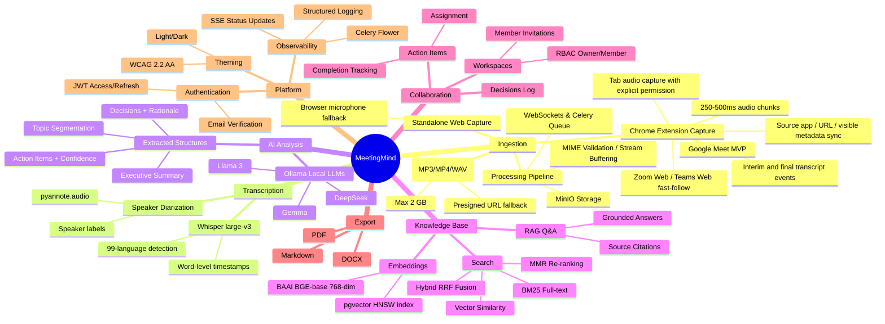
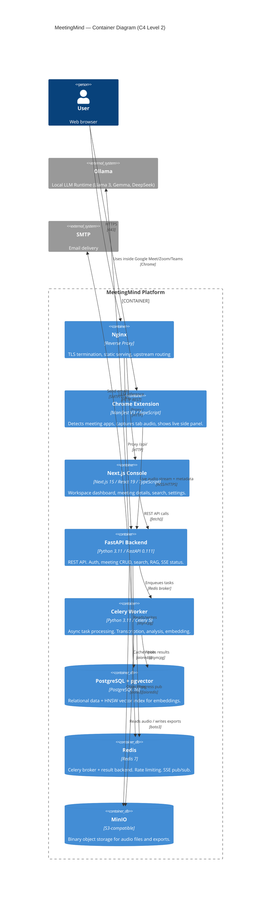
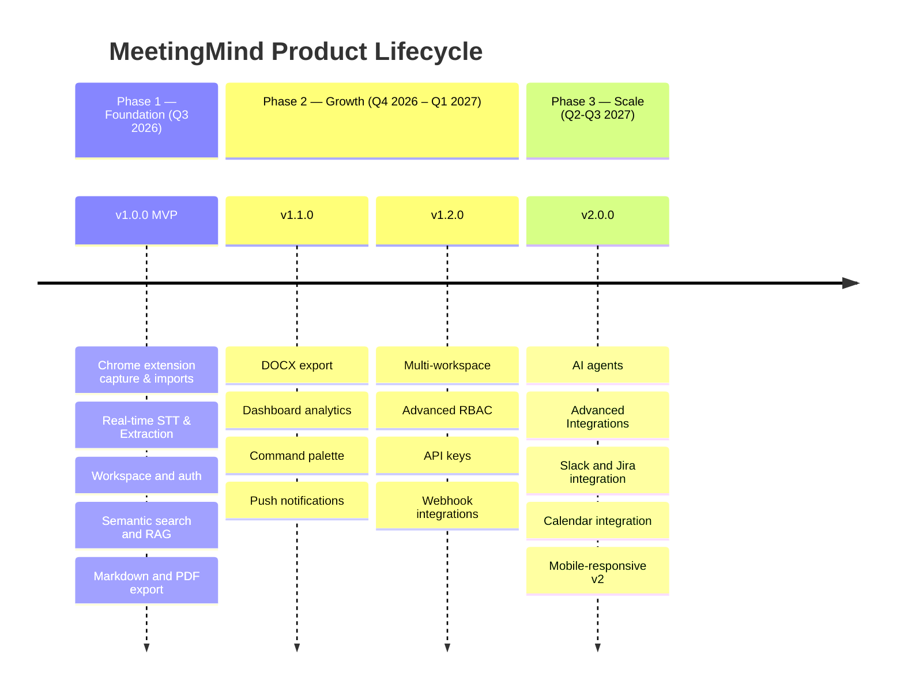

# MeetingMind — Product Overview

## Executive Summary

MeetingMind is a self-hosted, AI-powered meeting intelligence platform delivered as a Chrome extension plus a web console. The extension captures live meeting audio from existing meeting apps, starting with Google Meet, and transforms it into structured, searchable, and actionable organisational knowledge as the meeting happens. It is designed for organisations that require the productivity gains of AI meeting analysis without compromising data sovereignty by routing sensitive conversations through third-party cloud AI services.

The extension detects supported meeting pages, captures tab audio with explicit user permission, streams audio over the versioned v1 WebSocket protocol, and syncs available meeting context such as source app, URL, title, and visible participants. The backend transcribes speech with local Whisper-compatible streaming STT and runs rolling structured extraction - summaries, action items, decisions, and topic segmentation - through local Large Language Models (LLMs) served by Ollama. Recording import and standalone web capture remain supported as fallbacks, but v1 is extension-first. All extracted content is indexed in a pgvector-backed knowledge base, enabling hybrid semantic search and Retrieval-Augmented Generation (RAG) Q&A across the entire meeting corpus.

**The core value proposition:** teams gain the institutional knowledge embedded in their meetings — without giving that knowledge to an external cloud provider.

### Strategic Positioning

MeetingMind targets the intersection of three market trends:

1. **AI-augmented knowledge work** — demand for AI productivity tooling is at an all-time high, but trust concerns limit adoption of cloud AI for sensitive enterprise data.
2. **Meeting overload** — knowledge workers spend 31–50% of their working hours in meetings; only a fraction of that knowledge is captured and actionable.
3. **Data residency regulation** — GDPR, HIPAA, SOC 2, and emerging AI Act requirements are driving organisations toward on-premise or private-cloud AI deployments.

---

## Core Capability Map

---

## User Segments

| Segment | Role | Primary Needs | Key Workflows |
|---|---|---|---|
| **Knowledge Worker** | Meeting participant who uses Google Meet/Zoom/Teams | Extension-based live transcription, automatic summaries, action item capture, search across past meetings | Start extension capture → Review transcript and AI summary in console → Assign action items → Search for past decisions |
| **Team Lead / Manager** | Workspace owner, manages team | Oversight of team's meeting outputs, action item accountability, decision audit trail | Review action item completion, search for decisions made in team meetings, manage workspace members |
| **Executive / Stakeholder** | Occasional consumer of summaries | High-level summaries, fast retrieval of specific information | Ask Q&A against meeting corpus, review executive summary, export for reports |
| **IT Administrator** | Deploys and maintains the platform | Self-hosted control, security compliance, user management | Deploy via Docker Compose, configure OAuth/SMTP, monitor with Flower, manage storage |
| **Developer / Integrator** | Builds on top of MeetingMind | API access, webhooks, programmatic meeting data consumption | Use API keys, subscribe to webhooks, consume OpenAPI-documented endpoints |

---

## Competitive Positioning Matrix

The following matrix positions MeetingMind relative to the primary alternatives:

| Capability | MeetingMind | Otter.ai | Fireflies.ai | Notion AI | Local Whisper Script |
|---|---|---|---|---|---|
| **Data Sovereignty** | ✅ Full self-hosted | ❌ Cloud only | ❌ Cloud only | ❌ Cloud only | ✅ Local |
| **AI Transcription** | ✅ Whisper large-v3 | ✅ Proprietary | ✅ Proprietary | ❌ None | ✅ Whisper |
| **Structured Extraction** | ✅ Summary + AIs + Decisions + Topics | ✅ Summary + AIs | ✅ Summary + AIs | ✅ Summary | ❌ None |
| **Semantic Search** | ✅ Hybrid BM25 + Vector | ✅ Limited | ✅ Limited | ✅ Semantic | ❌ None |
| **RAG Q&A** | ✅ Full RAG | ❌ | ❌ | ✅ Limited | ❌ None |
| **Speaker Diarization** | ✅ pyannote | ✅ | ✅ | ❌ | ⚠️ Manual |
| **Local LLM Inference** | ✅ Ollama | ❌ | ❌ | ❌ | ❌ |
| **Workspace / RBAC** | ✅ Four-role RBAC in v1; multi-workspace UI in v1.2 | ✅ | ✅ | ✅ | ❌ None |
| **Export (PDF/DOCX/MD)** | ✅ All three | ✅ Partial | ✅ Partial | ✅ | ❌ None |
| **On-premise Deployment** | ✅ Docker Compose | ❌ | ❌ | ❌ | ✅ |
| **Open Source** | ✅ MIT | ❌ | ❌ | ❌ | ✅ |
| **API & Webhooks** | ✅ v1.2.0 | ✅ | ✅ | ✅ | ❌ None |
| **Calendar Integration** | 🔜 v2.0.0 | ✅ | ✅ | ❌ | ❌ None |
| **Real-time Transcription** | ✅ v1.0.0 | ✅ | ✅ | ❌ | ❌ None |
| **Cost** | Infrastructure only | $10–30/user/mo | $10–19/user/mo | $8–15/user/mo | Free |

**Key differentiator:** MeetingMind is the only solution in this matrix that combines enterprise-grade structured extraction, hybrid semantic search with RAG, and complete data sovereignty within a deployable open-source package.

---

## Technical Architecture Summary

The container diagram below illustrates the six primary runtime components and their relationships:

> See [architecture-overview.md](architecture-overview.md) for the full Level 1 context, Level 2 container, data flow, and deployment topology diagrams with technology decision rationale.

---

## Key Metrics Dashboard

The following table summarises the platform's target performance characteristics at MVP scale:

| Metric | Target | Measurement |
|---|---|---|
| Live transcript latency | < 2 seconds for interim text | Extension tab audio chunk → WebSocket → STT event |
| Recording import throughput | 2 GB per file | Presigned URL direct upload fallback |
| Batch transcription speed | 10× real-time (faster-whisper) | GPU: NVIDIA RTX 3090; CPU: ~1× real-time |
| AI analysis latency | < 90 seconds for 60-min meeting | End-to-end from queue pick-up to indexing |
| Search p95 latency | < 300 ms | Hybrid BM25 + pgvector HNSW |
| RAG Q&A latency | < 8 seconds | Retrieval + LLM generation |
| API p99 latency | < 500 ms | Non-AI CRUD endpoints |
| Transcript accuracy (WER) | < 8% (English, clear audio) | Evaluated on Common Voice test set |
| Action item precision | > 75% | Human evaluation on 100-meeting sample |
| System availability | 99.5% | Single-VPS deployment; target pre-HA |

---

## Product Lifecycle Phases

---

## Integration Roadmap

| Integration | Target Version | Direction | Description |
|---|---|---|---|
| MinIO | v1.0.0 ✅ | Internal | Default private object storage for audio and exports |
| External S3-compatible storage | Optional v1.0.0 | Outbound | Operator-enabled replacement for MinIO after egress/residency review |
| SMTP | Optional v1.0.0 | Outbound | Operator-enabled invitation delivery; the baseline can surface an admin-copyable invitation link |
| Ollama | v1.0.0 ✅ | Internal | Default local LLM inference |
| REST API (public) | v1.2.0 | Inbound | External systems query MeetingMind data |
| Webhooks | v1.2.0 | Outbound | Push events to external systems on meeting completion |
| Chrome Extension | v1.0.0 ✅ | Inbound | Capture Google Meet tab audio and meeting page context |
| Zoom Web / Teams Web | v1.1.0 | Inbound | Extend browser extension detection and capture support |
| Desktop App | v1.2.0 | Inbound | Capture native Zoom/Teams desktop meetings |
| Mobile Apps | v2.0.0 | Inbound | Android/iOS capture where platform permissions allow |
| Slack | v2.0.0 | Bidirectional | Post summaries to channels; receive recording links |
| Jira / Linear | v2.0.0 | Outbound | Sync extracted action items as tickets |
| Google Calendar / Outlook | v2.0.0 | Inbound | Auto-import meeting metadata from calendar events |
| SSO (SAML / OIDC) | v2.0.0 | Inbound | Enterprise identity provider integration |

---

## Pricing Model Overview

MeetingMind is intended to be open source, but the repository license file and copyright holder must be finalized before a specific license is claimed. The following managed-hosting model is a future concept, not a v1 application billing feature:

| Tier | Target | Pricing Model | Inclusions |
|---|---|---|---|
| **Community (Self-hosted)** | Individuals, small teams, developers | Free (open source) | Full feature set, community support via GitHub Issues |
| **Professional (Self-hosted)** | SMBs, engineering teams | Flat fee per deployment | Email support (48h SLA), upgrade assistance, priority issue triage |
| **Enterprise (Self-hosted)** | Large organisations, regulated industries | Annual contract | SSO/SAML, SLA, dedicated support channel, custom feature development |
| **Cloud (Managed)** | Teams without infrastructure | Per-seat per-month | Fully managed deployment, automatic upgrades, 99.9% SLA |

> The Community tier will always remain free and fully featured. Commercial tiers fund ongoing development.
