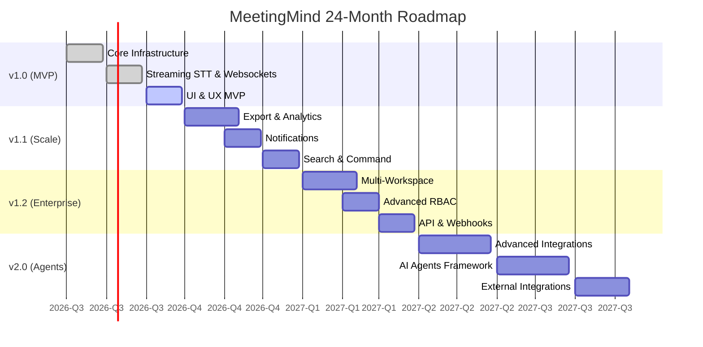

# MeetingMind — Product Roadmap

This document outlines the strategic 24-month roadmap for the MeetingMind platform. It is organized by major version milestones and quarters, detailing product features, infrastructure investments, and technical debt resolution.

## 1. Roadmap Overview

---

## 2. v1.0.0 — The MVP (Q3 2026)

**Theme:** Prove the privacy-first meeting intelligence loop.

### Product Features
* **Authentication & Workspaces:** Single-workspace registration, basic JWT auth, role management (Admin/Member).
* **Chrome Extension Capture:** Manifest V3 extension for Google Meet detection, tab-audio capture, live side panel, and secure workspace connection.
* **Real-Time Pipeline:** WebSocket/WebRTC architecture to stream audio live from the extension to the backend. Recording import and standalone web capture remain supported as fallback/backfill paths.
* **Streaming STT Engine:** Local streaming Whisper variants for live word-by-word transcription. External streaming STT providers are opt-in only.
* **Speaker Diarization:** Real-time continuous speaker tagging.
* **Rolling AI Extraction:** Live summaries and action items populated in real-time via streaming LLM output.
* **MeetingMind Console:** Dashboard and meeting details for extension-captured meetings, source app metadata, live transcript viewer, and WebSocket sync.
* **Semantic Search:** Basic RAG pipeline for searching past meetings.

### Infrastructure & Engineering
* **Deployment:** Single-node Docker Compose setup.
* **Backend:** FastAPI with WebSockets, PostgreSQL, Redis for pub/sub. (Moving away from Celery-only batch queues).
* **AI:** Ollama container integration, pgvector setup.
* **Frontend:** Chrome Extension (Manifest V3) capture client plus Next.js App Router console with shadcn/ui integration.

---

## 3. v1.1.0 — Productivity & Polish (Q4 2026)

**Theme:** Make the extracted knowledge actionable and exportable.

### Product Features
* **Export Engine:** Export meeting notes to PDF, DOCX, and Markdown.
* **Zoom Web and Teams Web Capture:** Extend the Chrome extension beyond Google Meet.
* **Dashboard Analytics:** Meeting volume stats, action item completion tracking.
* **Notification System:** In-app and email alerts for mentions, assigned action items, and completed processing.
* **Command Palette:** Global Cmd+K navigation and fuzzy search.
* **Speaker Management:** Ability to rename identified speakers and apply them to past meetings.

### Infrastructure & Engineering
* **Performance:** Frontend caching optimizations, bundle size reduction.
* **AI Pipeline:** Upgrade embedding models for better retrieval, optimize chunking strategy.
* **Tech Debt:** Refactor Celery task error handling and retry queues.
* **Monitoring:** Prometheus and Grafana dashboards for production instances.

---

## 4. v1.2.0 — Enterprise Readiness (Q1 2027)

**Theme:** Multi-tenancy, security, and extensibility.

### Product Features
* **Multi-Workspace:** Users can belong to and switch between multiple workspaces.
* **Advanced RBAC:** Custom roles, granular permission matrices, viewer-only seats.
* **Public API:** Documented REST API for external consumption with API key management.
* **Webhooks:** Outbound webhooks for events (`meeting.processed`, `action_item.created`).
* **SSO / SAML:** Enterprise authentication integrations (Okta, Azure AD).
* **Desktop Capture App:** Native desktop app for Zoom/Teams desktop meetings where browser extension capture cannot reach.

### Infrastructure & Engineering
* **Data Isolation:** Row-Level Security (RLS) implementation in PostgreSQL for strict tenant isolation.
* **Scalability:** Horizontal scaling support for Celery workers and FastAPI nodes.
* **Storage:** Migration path for external S3 integration instead of local MinIO.
* **Tech Debt:** Database migration audit, query optimization for large workspaces.

---

## 5. v2.0.0 — Proactive Intelligence (Q2-Q3 2027)

**Theme:** Shift from reactive retrieval to proactive AI agents.

### Product Features
* **AI Agents:** Autonomous agents that can query meeting history to generate weekly digests or prep briefs.
* **Workflow Integrations:** Native, two-way sync with Jira, Linear, and Slack.
* **Mobile Experience:** Fully responsive mobile web app V2 and Android/iOS capture exploration where platform permissions allow.

### Infrastructure & Engineering
* **Vector DB Scale:** Migration path from pgvector to Qdrant for deployments exceeding 10M chunks.
* **Agent Framework:** Implementation of LangGraph or similar stateful agent orchestration.
* **Tech Debt:** Deprecation of v1 legacy API endpoints.

---

## 6. Continuous Initiatives

Across all milestones, the engineering team maintains standing commitments to:

1. **Security Audits:** Automated dependency scanning weekly, manual penetration testing bi-annually.
2. **AI Model Benchmarking:** Continuous evaluation of new open-weights models (e.g., Llama 4, new Whisper iterations) against our golden dataset to improve WER and extraction accuracy.
3. **Accessibility (WCAG 2.2 AA):** Dedicated testing sprint at the end of every quarter to ensure all new UI components meet compliance.
