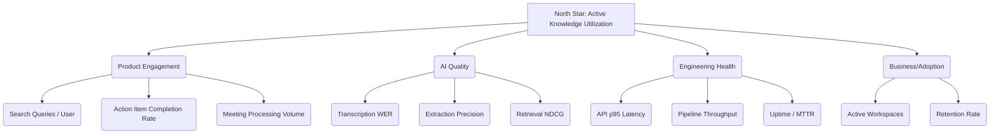

# MeetingMind — Success Metrics Framework

This document outlines the KPIs, OKRs, and telemetry used to measure the success of the MeetingMind platform across product, engineering, AI quality, and business dimensions.

## 1. Metrics Hierarchy

---

## 2. Product Engagement Metrics

These metrics track how users derive value from the application.

| Metric | Definition | Baseline | 6-Month Target | 12-Month Target | Measurement Tool |
|---|---|---|---|---|---|
| **Action Item Completion Rate** | % of extracted action items marked complete within 14 days | ~30% (industry) | >50% | >70% | App DB (PostHog/Mixpanel) |
| **Search Utilization** | Average number of RAG search queries per active user per week | 0 | 3.5 | 7.0 | App DB Analytics |
| **Export Frequency** | % of processed meetings exported to PDF/Docs | 0% | 15% | 25% | App DB Analytics |
| **Time to Discovery** | Time elapsed from search execution to citation click | N/A | < 15s | < 10s | Client Telemetry |
| **Meeting Coverage** | % of total organizational meetings processed through the platform | < 10% | 30% | 60% | Survey / Self-Report |

---

## 3. AI Quality Metrics

These are critical for maintaining user trust in the system.

| Metric | Definition | Baseline | 6-Month Target | 12-Month Target | Measurement Tool |
|---|---|---|---|---|---|
| **Word Error Rate (WER)** | (Substitutions + Deletions + Insertions) / Total Words on standard English dataset | 8.5% | < 5.0% | < 3.5% | CI Benchmark Suite |
| **Action Extraction Precision** | True Positives / (True Positives + False Positives) | 60% | > 85% | > 92% | Human QA Sample |
| **Action Extraction Recall** | True Positives / (True Positives + False Negatives) | 70% | > 80% | > 90% | Human QA Sample |
| **Retrieval NDCG@5** | Normalized Discounted Cumulative Gain for top 5 RAG search results | N/A | > 0.75 | > 0.85 | CI Benchmark Suite |
| **Hallucination Rate** | % of AI summary claims unsupported by the transcript | Unknown | < 2% | < 0.5% | Human QA Sample |

---

## 4. Engineering Health & Performance

These metrics ensure the platform remains stable, responsive, and scalable.

| Metric | Definition | Baseline | 6-Month Target | 12-Month Target | Measurement Tool |
|---|---|---|---|---|---|
| **API Latency (p95)** | 95th percentile response time for core CRUD endpoints | 300ms | < 200ms | < 150ms | Prometheus / Grafana |
| **Pipeline Processing Time** | End-to-end processing time for a 60-minute meeting | 15m (CPU) | < 8m | < 4m (GPU opt) | Celery Metrics / Grafana |
| **Uptime (Availability)** | % of time the core API and UI are reachable | N/A | 99.5% | 99.9% | UptimeRobot / Pingdom |
| **Test Coverage** | % of backend and frontend code covered by automated tests | 0% | > 75% | > 85% | Codecov / SonarQube |
| **Deployment Frequency** | Number of successful deployments to production per week | 0 | 2 | 5+ | GitHub Actions Analytics |
| **MTTR** | Mean Time To Recovery for Sev1 incidents | N/A | < 4h | < 1h | Incident Management Tool |

---

## 5. Business & Adoption Metrics

These metrics define the commercial and organizational footprint of the project.

| Metric | Definition | Baseline | 6-Month Target | 12-Month Target |
|---|---|---|---|---|
| **Active Workspaces** | Number of unique self-hosted deployments actively processing meetings | 0 | 50 | 200 |
| **Monthly Active Users (MAU)** | Unique users logging in across all known deployments | 0 | 500 | 2,500 |
| **W1 Retention** | % of users returning in week 2 after their first meeting upload | N/A | > 40% | > 60% |
| **Volume Processed** | Total hours of meeting audio processed monthly across the network | 0 | 2,000 hrs | 10,000 hrs |

---

## 6. Telemetry & Privacy Philosophy

Because MeetingMind is a privacy-first, self-hosted platform:
1. **No Content Telemetry:** We never collect transcripts, audio, summaries, or search queries.
2. **Opt-In Usage Telemetry:** Anonymous usage statistics (e.g., number of meetings processed, errors encountered) are completely opt-in.
3. **Local Dashboards:** Administrators are provided with local Grafana dashboards to view their own instance's Engineering and AI Quality metrics without sending data back to the core team.

## 7. Review Cadence
* **Engineering Metrics:** Reviewed weekly during engineering standups.
* **Product Metrics:** Reviewed bi-weekly by the product team.
* **AI Quality Metrics:** Benchmarked continuously in CI, reviewed fully at the end of each sprint.
* **Business Metrics:** Reviewed monthly by leadership.
