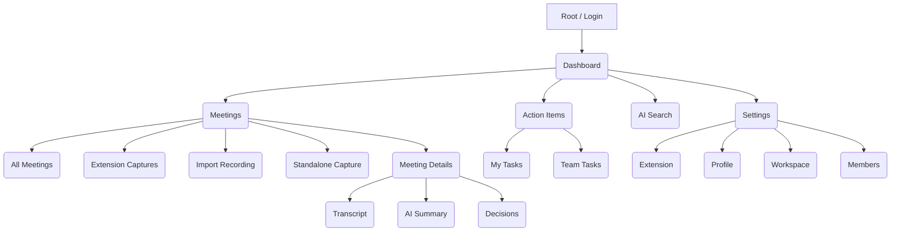

# MeetingMind — Information Architecture

This document defines the structural design of the MeetingMind platform, detailing how information is organized, labeled, and navigated.

## 1. Sitemap

## 2. Navigation Hierarchy

### 2.1 Primary Navigation (Sidebar)
* **Dashboard** (Home icon) - Overview of recent activity and metrics.
* **Meetings** (Video icon) - Central repository of all extension-captured, standalone-captured, and imported meetings.
* **Action Items** (Check-square icon) - Cross-meeting task tracker.
* **AI Search** (Sparkles/Search icon) - Global RAG interface.
* **Settings** (Gear icon, pinned to bottom).

### 2.2 Secondary Navigation (Tabs within Views)
* **Meeting Details View:**
  * Summary (Default)
  * Transcript
  * Action Items
  * Decisions
* **Settings View:**
  * Profile
  * Workspace Settings
  * Members

### 2.3 Tertiary Navigation
* **Breadcrumbs:** Used heavily to maintain context (e.g., `Meetings / Weekly Syncs / Q3 Architecture Review`).
* **Command Palette (Cmd+K):** Universal shortcut for jumping directly to any node in the IA.

## 3. URL Routing Table (Next.js App Router)

| Route | Page / Purpose | Accessibility |
|---|---|---|
| `/` | Landing / Login redirect | Public |
| `/login` | Authentication form | Public |
| `/register` | Account creation | Public |
| `/dashboard` | Main application overview | Authenticated |
| `/meetings` | List of all workspace meetings | Authenticated |
| `/meetings/new` | Standalone web live capture fallback | Authenticated |
| `/meetings/import` | Recording import fallback | Authenticated |
| `/meetings/[id]` | Meeting details (Summary tab) | Authenticated |
| `/meetings/[id]/transcript` | Full text transcript viewer | Authenticated |
| `/meetings/[id]/actions` | Action items filtered to this meeting | Authenticated |
| `/search` | Global AI RAG search interface | Authenticated |
| `/actions` | Global action item tracker | Authenticated |
| `/settings/profile` | User preferences | Authenticated |
| `/settings/workspace` | Workspace name/billing | Admin Only |
| `/settings/members` | Role management and invites | Admin Only |
| `/settings/extension` | Chrome extension connection and capture settings | Authenticated |

## 4. Content Taxonomy

### 4.1 Meeting Entities
* **Meeting Object:** ID, Title, Date, Creator, Duration, SourceType, SourceApp, SourceURL, VisibleParticipants, Status (Detected/Scheduled/Recording/Transcribing/Analyzing/Complete/Failed).
* **Segment:** A block of transcript text with StartTime, EndTime, and SpeakerID.
* **Summary Block:** AI-generated markdown text summarizing the whole meeting or specific topics.
* **Action Item:** Task Description, Assignee (SpeakerID or UserID), Due Date, Status (Open/Closed).
* **Decision:** Markdown text detailing a concluded agreement.

### 4.2 Workspace Entities
* **Workspace:** ID, Name, CreatedAt.
* **User:** ID, Name, Email, AvatarURL, Role (Owner, Admin, Member, Viewer).

## 5. Organizational Philosophy

MeetingMind utilizes a **flat hierarchical structure**. Meetings are not organized into deep folder trees. Instead, we rely on flat lists augmented by powerful filtering, metadata tagging, and semantic search. This prevents the "where did I save that file?" problem common in traditional wikis.
