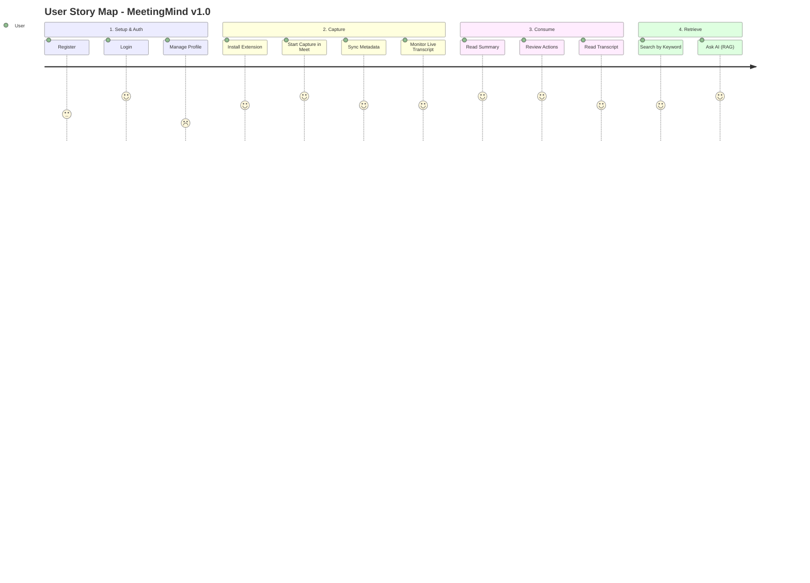

# MeetingMind — Product Requirements Document

## 1. Executive Summary

MeetingMind is a privacy-first, AI-powered meeting intelligence platform designed for engineering-led organizations. It is delivered as a Chrome extension plus a web console: the extension captures live meeting audio from existing meeting apps, and the console stores transcripts, summaries, action items, decisions, recordings, and searchable knowledge entirely on the organization's own infrastructure. This PRD defines the requirements for v1.0 (MVP), which focuses on reliable Google Meet capture, live AI processing, and basic knowledge retrieval. Recording import and standalone web capture are secondary fallback paths.

## 2. Problem Statement

Teams lose critical context, decisions, and action items shortly after meetings conclude. Existing tools (Otter.ai, Fathom) require sending highly sensitive strategic discussions to third-party cloud providers, violating many organizations' data sovereignty policies. Consequently, privacy-conscious teams are left with manual note-taking, which is inconsistent, unsearchable, and non-scalable.

## 3. Goals & Non-Goals

### 3.1 Goals (v1.0)
* Provide a self-hosted platform for Chrome-extension-based real-time meeting capture and processing.
* Support Google Meet as the first capture target, with Zoom Web and Microsoft Teams Web as fast-follow targets.
* Transcribe audio accurately (>95% accuracy) using local AI.
* Automatically extract rolling summaries, action items, and decisions using local LLMs.
* Provide semantic search across all processed meetings.
* Deliver a responsive, accessible (WCAG 2.2 AA) web interface.
* Support recording import and standalone web capture for backfilling or fallback capture.

### 3.2 Non-Goals (v1.0)
* Native mobile applications (iOS/Android).
* User-facing creation or switching among multiple workspaces (deferred to v1.2).
* Real-time collaborative editing of transcripts/summaries.

## 4. User Personas Summary

* **Primary:** Maya Chen (Engineering Manager) - Needs to track action items and decisions across multiple squad meetings.
* **Secondary:** Sarah Kim (Product Manager) - Needs to search past meetings to recall feature requirements.
* **Tertiary:** Marcus Rodriguez (IT/DevOps) - Needs to deploy and maintain the system securely.

*(See [User Personas](user-personas.md) for detailed profiles).*

## 5. User Story Map

## 6. Functional Requirements (Epics)

### Epic 1: Authentication & Workspace
* **Req 1.1:** On a fresh deployment with zero users, the first-run setup flow must atomically create the initial Owner account and the deployment's default workspace.
* **Req 1.2:** After first-run setup completes, public registration must close and new users may register only through a valid, single-use, expiring workspace invitation.
* **Req 1.3:** v1 exposes one active default workspace per deployment. The underlying workspace-scoped data model remains ready for future multi-workspace support, but arbitrary workspace creation and switching are not exposed until v1.2.
* **Req 1.4:** v1 workspace roles are Owner, Admin, Member, and Viewer. Authorization must be enforced by the backend for every workspace-scoped resource.
* **Req 1.5:** Owners and Admins can invite users by email with an allowed role; only an Owner can grant or remove the Owner role.
* **Req 1.6:** Password reset uses a single-use, expiring token and must not reveal whether an email address exists.

### Epic 2: Extension-Based Real-Time Meeting Capture
* **Req 2.1:** Users can install and authenticate the MeetingMind Chrome extension.
* **Req 2.2:** The extension detects supported meeting pages, starting with Google Meet.
* **Req 2.3:** Users can manually start/stop MeetingMind capture from the extension side panel or popup.
* **Req 2.4:** The extension captures tab audio with explicit user permission and streams self-framed 250-500ms PCM chunks through the versioned v1 WebSocket protocol. WebRTC is not a v1 transport.
* **Req 2.5:** The extension syncs available meeting context, including source app, meeting URL, visible title, start/end time, and visible participants where accessible.
* **Req 2.6:** The extension UI must show capture state (Detected -> Connecting -> Recording -> Transcribing -> Analyzing -> Completed/Failed).
* **Req 2.7:** Users see interim and final transcript segments update during the meeting in the extension side panel and web console when open.
* **Req 2.8:** Recording import for MP3, MP4, WAV, M4A, and WebM files up to 2GB is supported as a secondary backfill flow.
* **Req 2.9:** Standalone web live capture is supported as a fallback for unsupported meeting apps.

### Epic 3: AI Processing & Display
* **Req 3.1:** The system must generate a speaker-diarized transcript.
* **Req 3.2:** The transcript viewer must support clicking a segment to copy it or link to it.
* **Req 3.3:** The system must generate versioned structured summaries with Executive Summary, Key Points, and citations to exact transcript segments.
* **Req 3.4:** The system must extract explicit Action Items (Task, Assignee, Due Date) with source citations and preserve user edits.
* **Req 3.5:** The system must extract explicit Decisions with context, rationale, and source citations.
* **Req 3.6:** Reprocessing must record provider/model/prompt/input lineage and append new output versions without silently overwriting earlier auditable output.

### Epic 4: Knowledge Retrieval
* **Req 4.1:** Users can execute semantic search across all meetings in the workspace.
* **Req 4.2:** The search engine must answer natural language questions using RAG.
* **Req 4.3:** AI answers must include clickable citations linking to the exact meeting transcript segment.
* **Req 4.4 (v1.1 fast-follow, not v1 acceptance):** Global Command Palette (Cmd+K) for quick navigation to recent meetings.

## 7. Success Criteria
* **Engagement:** 50% of captured or imported meetings have their action items reviewed/checked off within 7 days.
* **Quality:** AI Transcription achieves < 5% Word Error Rate on clear English audio.
* **Performance:** Semantic search returns AI-generated RAG answers in < 10 seconds.
* **Adoption:** 20 active organizations deploying MeetingMind within 3 months of launch.

## 8. Risks & Mitigations

| Risk | Impact | Likelihood | Mitigation |
|---|---|---|---|
| Local LLM (Llama 3) hallucinates action items | High | Medium | Implement strict JSON schemas and low-temperature prompting. Require user review. |
| Whisper transcription fails on low-resource VPS | High | High | Document strict minimum hardware requirements (4 cores, 16GB RAM). Implement chunking. |
| Users find Docker deployment too complex | Medium | Medium | Provide copy-paste deployment scripts and thorough DevOps documentation. |

## 9. Timeline (High-Level)
* **Month 1:** Infrastructure, Auth, Chrome extension capture pipeline.
* **Month 2:** AI Pipeline (Whisper, LLM integration), Core UI components.
* **Month 3:** RAG Search, Polish, Testing, v1.0 Release.
