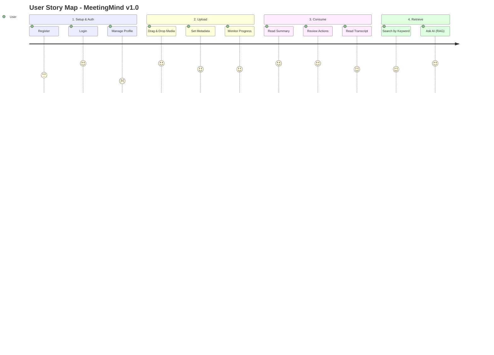

# MeetingMind — Product Requirements Document

## 1. Executive Summary

MeetingMind is a privacy-first, AI-powered meeting intelligence platform designed for engineering-led organizations. It ingests audio/video recordings and extracts transcripts, summaries, action items, and decisions entirely on the organization's own infrastructure. This PRD defines the requirements for v1.0 (MVP), which focuses on reliable core processing and basic knowledge retrieval.

## 2. Problem Statement

Teams lose critical context, decisions, and action items shortly after meetings conclude. Existing tools (Otter.ai, Fathom) require sending highly sensitive strategic discussions to third-party cloud providers, violating many organizations' data sovereignty policies. Consequently, privacy-conscious teams are left with manual note-taking, which is inconsistent, unsearchable, and non-scalable.

## 3. Goals & Non-Goals

### 3.1 Goals (v1.0)
* Provide a self-hosted platform for uploading and processing meeting recordings.
* Transcribe audio accurately (>95% accuracy) using local AI.
* Automatically extract summaries, action items, and decisions using local LLMs.
* Provide semantic search across all processed meetings.
* Deliver a responsive, accessible (WCAG 2.2 AA) web interface.

### 3.2 Non-Goals (v1.0)
* Real-time meeting processing or live bot integration (Zoom/Teams bots).
* Native mobile applications (iOS/Android).
* Multi-workspace SaaS architecture.
* Real-time collaborative editing of transcripts/summaries.

## 4. User Personas Summary

* **Primary:** Maya Chen (Engineering Manager) - Needs to track action items and decisions across multiple squad meetings.
* **Secondary:** Sarah Kim (Product Manager) - Needs to search past meetings to recall feature requirements.
* **Tertiary:** Marcus Rodriguez (IT/DevOps) - Needs to deploy and maintain the system securely.

*(See [User Personas](user-personas.md) for detailed profiles).*

## 5. User Story Map

## 6. Functional Requirements (Epics)

### Epic 1: Authentication & Workspace
* **Req 1.1:** Users must be able to register with email/password.
* **Req 1.2:** Users must be grouped into a single default workspace (v1.0).
* **Req 1.3:** Workspace Admins can invite new users via email link.
* **Req 1.4:** Password reset flow via secure email link.

### Epic 2: Meeting Ingestion
* **Req 2.1:** Users can upload MP3, MP4, WAV, M4A, WebM files up to 2GB.
* **Req 2.2:** Uploads must show real-time percentage progress.
* **Req 2.3:** Users can input meeting title, date, and select participants during upload.
* **Req 2.4:** The system must visualize the current processing state (Queued -> Transcribing -> Analyzing).

### Epic 3: AI Processing & Display
* **Req 3.1:** The system must generate a speaker-diarized transcript.
* **Req 3.2:** The transcript viewer must support clicking a segment to copy it or link to it.
* **Req 3.3:** The system must generate a structured summary with Executive Summary and Key Points.
* **Req 3.4:** The system must extract explicit Action Items (Task, Assignee, Due Date).
* **Req 3.5:** The system must extract explicit Decisions with context.

### Epic 4: Knowledge Retrieval
* **Req 4.1:** Users can execute semantic search across all meetings in the workspace.
* **Req 4.2:** The search engine must answer natural language questions using RAG.
* **Req 4.3:** AI answers must include clickable citations linking to the exact meeting transcript segment.
* **Req 4.4:** Global Command Palette (Cmd+K) for quick navigation to recent meetings.

## 7. Success Criteria
* **Engagement:** 50% of uploaded meetings have their action items reviewed/checked off within 7 days.
* **Quality:** AI Transcription achieves < 5% Word Error Rate on clear English audio.
* **Performance:** Semantic search returns AI-generated RAG answers in < 10 seconds.
* **Adoption:** 20 active organizations deploying MeetingMind within 3 months of launch.

## 8. Risks & Mitigations

| Risk | Impact | Likelihood | Mitigation |
|---|---|---|---|
| Local LLM (Llama 3) hallucinates action items | High | Medium | Implement strict JSON schemas and low-temperature prompting. Require user review. |
| Whisper transcription fails on low-resource VPS | High | High | Document strict minimum hardware requirements (4 cores, 16GB RAM). Implement chunking. |
| Users find Docker deployment too complex | Medium | Medium | Provide copy-paste deployment scripts and thorough DevOps documentation. |

## 9. Timeline (High-Level)
* **Month 1:** Infrastructure, Auth, Upload Pipeline.
* **Month 2:** AI Pipeline (Whisper, LLM integration), Core UI components.
* **Month 3:** RAG Search, Polish, Testing, v1.0 Release.
