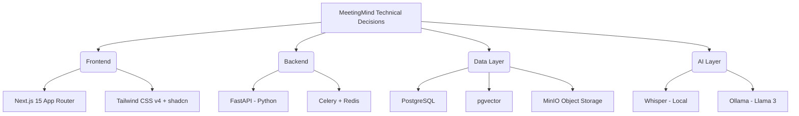

# MeetingMind — Technical Requirements Document

## 1. Introduction
This document defines the technical constraints, architectural requirements, performance targets, and security standards for MeetingMind v1.0. It bridges the product requirements (PRD) with the engineering implementation.

## 2. Architecture Decision Summary

## 3. System Architecture Requirements

### 3.1 Infrastructure
* **Deployment Model:** Containerized deployment via Docker Compose.
* **Operating System:** Target host is any standard Linux distribution (Ubuntu 22.04+ recommended).
* **Hardware Requirements:** Minimum 4 vCPU, 16GB RAM. Recommended 8 vCPU, 32GB RAM + NVIDIA GPU for optimal inference speed.

### 3.2 Frontend Stack
* **Capture Client:** Chrome Extension using Manifest V3 and TypeScript.
* **Framework:** React 19 / Next.js 15 utilizing the App Router.
* **Language:** TypeScript (Strict mode enabled).
* **Styling:** Tailwind CSS v4, utilizing CSS variables for theme tokens.
* **Components:** Radix UI primitives wrapped by shadcn/ui.
* **State:** TanStack Query for server state; Zustand for client state.

### 3.3 Backend Stack
* **API Framework:** FastAPI (Python 3.12+).
* **ORM:** SQLAlchemy 2.0 (async mode) with Alembic for migrations.
* **Task Queue:** Celery with Redis broker.
* **Storage Interface:** Boto3 for S3/MinIO compatibility.

## 4. Performance Requirements

* **API Latency:** 
  * 95th percentile (p95) response time for standard CRUD operations must be < 200ms.
  * Search queries (excluding LLM generation) must return in < 500ms.
* **Extension Capture Performance:**
  * Interim transcript events should appear within < 2 seconds of audible speech under normal network conditions.
  * Extension startup and meeting detection should complete within < 1 second after a supported meeting tab loads.
* **Frontend Performance:**
  * Largest Contentful Paint (LCP) < 2.5s.
  * Cumulative Layout Shift (CLS) < 0.1.
* **Processing Throughput:**
  * A 60-minute meeting audio file must process end-to-end (transcription + analysis + embedding) in under 15 minutes on CPU-only hardware, or under 5 minutes with GPU acceleration.
* **Streaming:**
  * RAG AI answers must utilize Server-Sent Events (SSE) to stream tokens to the UI with < 1s Time-To-First-Token (TTFT).

## 5. Security & Data Sovereignty

* **Data Isolation:** All data (audio, transcripts, vectors) MUST remain on the host machine. No external API calls (e.g., OpenAI, Anthropic) are permitted in the default configuration.
* **Authentication:** Stateless JWT implementation. Access tokens (15m expiry), Refresh tokens (7d expiry, HTTP-only, secure, SameSite=Lax).
* **Password Hashing:** Bcrypt with a minimum work factor of 12.
* **Input Validation:** All API inputs must be strictly validated using Pydantic schemas.
* **Stream & Import Security:** Live audio chunks must be authenticated, rate-limited, and bounded by session limits. Imported files must be validated by MIME type and magic numbers, with max import size strictly enforced at the reverse proxy (Nginx) and application levels (2GB).

## 6. AI Pipeline Requirements

* **Transcription:** Open-source Whisper-compatible streaming STT for Chrome extension and fallback web live sessions. Imported recordings longer than 10 minutes must be chunked to prevent memory exhaustion.
* **LLM Inference:** Must communicate via Ollama's REST API.
* **Embeddings:** BAAI BGE embeddings (768 dimensions).
* **Vector Storage:** pgvector extension on PostgreSQL. Must use HNSW indexing for performance at scale.
* **Idempotency:** AI processing tasks must be idempotent. If a stream reconnects or a Celery worker dies during imported-recording processing, restarting the step must not corrupt data.

## 7. API Requirements

* **Design:** RESTful architecture.
* **Versioning:** URL-based versioning (e.g., `/api/v1/...`).
* **Error Handling:** Must follow RFC 7807 Problem Details for HTTP APIs.
* **Pagination:** Cursor-based pagination required for all list endpoints expected to return > 50 items (Meetings, Action Items).

## 8. Scalability Path

While v1.0 targets single-node deployments, the architecture must not preclude horizontal scaling:
* Application state must not be stored in memory on API nodes (use Redis).
* Celery workers must be designed to run concurrently across multiple machines.
* MinIO and PostgreSQL must be independently addressable via environment variables to allow off-node deployment.
