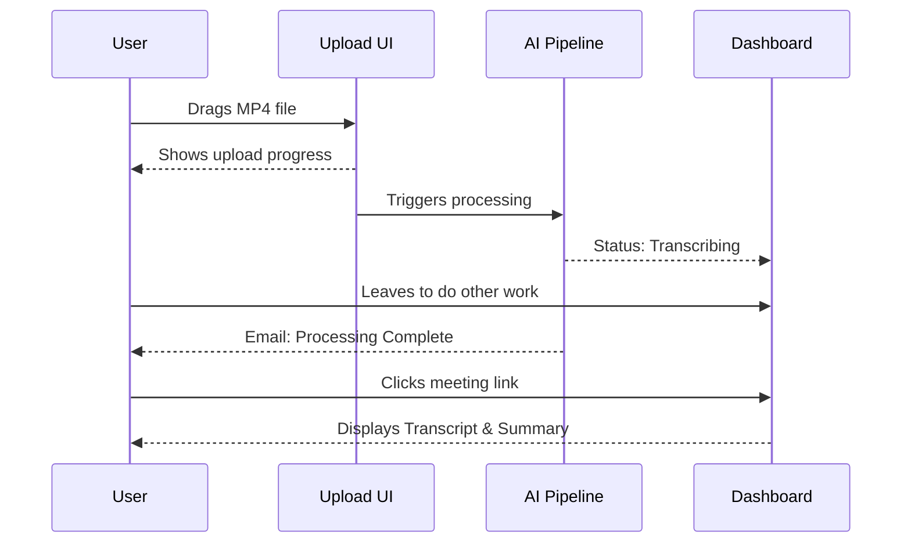

# MeetingMind — User Journeys

This document maps out the critical paths users take through MeetingMind to achieve their goals, detailing their actions, touchpoints, and emotional states.

## 1. Journey: First Meeting Upload and Review

**Persona:** Maya (Engineering Manager)  
**Goal:** Process a recorded architecture review and extract action items.

**Step-by-Step Flow:**
1. **Trigger:** Meeting ends; Maya has an MP4 recording on her desktop.
2. **Action:** Logs into MeetingMind and clicks "Upload Meeting".
3. **Action:** Drags the MP4 into the drop zone and enters "Q3 Architecture Review".
4. **Touchpoint (UploadZone):** Sees clear, fast progress bar. *(Emotion: Satisfied)*
5. **Touchpoint (Dashboard):** Sees the meeting in the list with a pulsing "Processing" badge.
6. **Action:** Closes tab, goes to eat lunch.
7. **Trigger:** Receives email notification: "Q3 Architecture Review is ready".
8. **Action:** Clicks link, arrives at Meeting Details page.
9. **Touchpoint (Meeting Details):** Sees the AI Summary. It perfectly captured the DB migration debate. *(Emotion: Delighted)*
10. **Action:** Clicks the "Action Items" tab. Sees three tasks correctly assigned.
11. **Action:** Clicks "Share" to copy the meeting link and pastes it into the team Slack.

---

## 2. Journey: Finding a Past Decision via AI Search

**Persona:** Sarah (Product Manager)  
**Goal:** Recall exactly why the team decided to drop support for IE11.

**Step-by-Step Flow:**
1. **Trigger:** An enterprise client complains about IE11 support. Sarah needs to justify the deprecation.
2. **Action:** Opens MeetingMind and hits `Cmd+K` to open the Command Palette.
3. **Action:** Types "IE11 support decision". Hits Enter.
4. **Touchpoint (AI Search):** The search page opens. A skeleton loader pulses briefly.
5. **Touchpoint (AI Search):** Text streams in: *"In the Q1 Roadmap Sync (Jan 12), the team decided to drop IE11 support because it accounted for <0.5% of traffic but consumed 15% of QA time [1]."* *(Emotion: Relieved)*
6. **Action:** Sarah hovers over the `[1]` citation. A tooltip shows the exact transcript snippet.
7. **Action:** She clicks the citation.
8. **Touchpoint (Transcript Viewer):** She is taken directly to the 14:22 mark in the "Q1 Roadmap Sync" transcript, where Maya made the call.
9. **Action:** She copies the transcript segment and drops it into her client response email. *(Emotion: Empowered)*

---

## 3. Journey: Reviewing and Assigning Action Items

**Persona:** David (Knowledge Worker/Dev)  
**Goal:** Figure out what he is supposed to be working on this week.

**Step-by-Step Flow:**
1. **Trigger:** Monday morning planning.
2. **Action:** Logs into MeetingMind Dashboard.
3. **Touchpoint (Dashboard):** Looks at the "My Action Items" widget.
4. **Action:** Sees "Investigate Redis latency spikes" assigned to him from the "Post-Mortem" meeting.
5. **Touchpoint (Dashboard):** Realizes the due date is missing.
6. **Action:** Clicks the action item inline to edit it, setting the due date to Friday.
7. **Action:** Checks the box next to "Update API docs" which he finished on Friday. The item crosses out and fades away. *(Emotion: Satisfied)*

---

## 4. Journey: Deploying and Monitoring the System

**Persona:** Marcus (DevOps)  
**Goal:** Deploy MeetingMind securely on internal infrastructure.

**Step-by-Step Flow:**
1. **Trigger:** VP Eng tasks Marcus with setting up MeetingMind.
2. **Action:** Marcus reads the README and clones the repo to an internal Ubuntu VPS.
3. **Action:** Copies `.env.example` to `.env` and generates secure passwords.
4. **Action:** Runs `docker compose up -d`.
5. **Touchpoint (CLI):** Watches images pull and containers start.
6. **Action:** Maps the internal domain `meetings.internal.corp` via Nginx.
7. **Action:** Navigates to the domain.
8. **Touchpoint (Auth):** Sees the clean login screen. Registers the first admin account. *(Emotion: Relieved it was that easy)*
9. **Action:** Uploads a test audio file. Opens `htop` on the server.
10. **Touchpoint (CLI):** Watches Python processes max out the CPU as Whisper runs, then successfully return to idle.
11. **Action:** Integrates the Prometheus `/metrics` endpoint into the company Grafana.

---

## 5. Journey: Exporting a Meeting Report

**Persona:** Maya (Engineering Manager)  
**Goal:** Share the outcomes of a strategic meeting with leadership who do not use MeetingMind.

**Step-by-Step Flow:**
1. **Trigger:** VP Eng asks for the summary of the "Q4 Resource Allocation" meeting.
2. **Action:** Maya opens the meeting in MeetingMind.
3. **Action:** Clicks the "Export" button in the header.
4. **Touchpoint (Dropdown):** Selects "Export as PDF".
5. **Touchpoint (Loading):** A brief spinner appears.
6. **Action:** The PDF downloads to her machine.
7. **Action:** Opens the PDF.
8. **Touchpoint (PDF Viewer):** The PDF is beautifully formatted with MeetingMind branding, containing the AI Summary, Decisions, and Action Items (excluding the raw 30-page transcript to keep it brief). *(Emotion: Professional & Prepared)*
9. **Action:** Emails the PDF to the VP.
