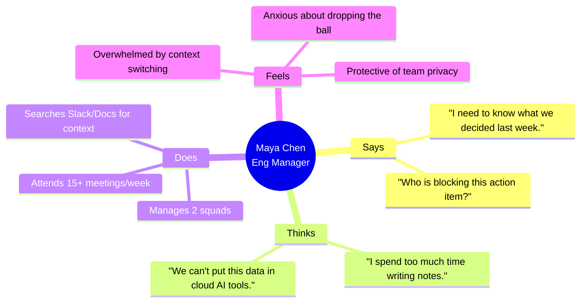

# MeetingMind — User Personas

This document outlines the core user personas for MeetingMind. Designing for these specific archetypes ensures our product decisions remain focused and user-centric.

## 1. Persona Empathy Map (Primary Persona)

---

## 2. Detailed Personas

### 2.1 Maya Chen — The Engineering Manager (Primary)

* **Role:** Engineering Manager at a mid-sized fintech startup.
* **Demographics:** 34 years old, based in Toronto.
* **Tech Proficiency:** Expert. Comfortable with APIs, Git, and complex SaaS.
* **Typical Workflow:** Attends daily standups, weekly architecture reviews, and 1:1s. Often takes frantic notes in Notion while trying to actively participate.
* **Goals:**
  1. Ensure technical decisions are documented and accessible to the whole team.
  2. Track action items without micro-managing.
  3. Keep meetings focused and short.
* **Pain Points:**
  1. Spends 3+ hours a week formatting and distributing meeting notes.
  2. Struggles to onboard new devs because past context is lost in verbal history.
  3. Cannot use tools like Otter.ai because fintech compliance forbids third-party AI on sensitive data.
* **How She Uses MeetingMind:** Uploads architecture reviews to generate searchable decision logs. Uses the dashboard to track overdue action items across her squads.
* **Quote:** *"If it's not documented, it didn't happen. But nobody has time to document everything."*

---

### 2.2 Sarah Kim — The Product Manager (Secondary)

* **Role:** Senior PM at a B2B SaaS company.
* **Demographics:** 29 years old, based in London.
* **Tech Proficiency:** High. Lives in Jira, Linear, and Figma.
* **Typical Workflow:** Conducts user interviews, stakeholder alignments, and sprint planning.
* **Goals:**
  1. Extract raw user insights from interview recordings quickly.
  2. Settle debates by retrieving exact quotes from past stakeholder meetings.
* **Pain Points:**
  1. "He said, she said" arguments about feature requirements.
  2. Rewatching 45-minute user interviews to find a 2-minute insight.
* **How She Uses MeetingMind:** Relies heavily on Semantic AI Search to query past user interviews ("What did Enterprise users say about the dashboard layout?").
* **Quote:** *"I need the exact quote, not just my interpretation of what the user wanted."*

---

### 2.3 Arjun Patel — The VP of Engineering (Tertiary)

* **Role:** VP of Engineering.
* **Demographics:** 42 years old, based in San Francisco.
* **Tech Proficiency:** Expert, though writes less code nowadays.
* **Typical Workflow:** High-level strategy, cross-departmental alignment, board meetings.
* **Goals:**
  1. Understand organizational velocity and recurring blockers.
  2. Ensure compliance and data security across the org.
* **Pain Points:**
  1. Disconnected from day-to-day technical decisions until they become problems.
  2. High risk of IP leakage through shadow IT (devs using unauthorized AI tools).
* **How He Uses MeetingMind:** Approves the deployment of MeetingMind because it is self-hosted. Uses proactive AI insights to spot recurring blockers across squads.
* **Quote:** *"I want our teams to have cutting-edge AI, but I won't compromise our SOC2 compliance to get it."*

---

### 2.4 Marcus Rodriguez — The IT / DevOps Operator

* **Role:** Lead DevOps Engineer.
* **Demographics:** 31 years old, based in Austin.
* **Tech Proficiency:** Elite. Master of Kubernetes, Docker, and Linux.
* **Typical Workflow:** Managing infrastructure, monitoring alerts, upgrading internal tools.
* **Goals:**
  1. Keep internal services running with 99.9% uptime.
  2. Minimize maintenance overhead of self-hosted tools.
* **Pain Points:**
  1. Self-hosted software with terrible documentation or fragile upgrade paths.
  2. Unpredictable resource spikes (especially from AI/ML workloads).
* **How He Uses MeetingMind:** He doesn't use it for meetings; he deploys and monitors it. Uses the Docker Compose setup, Grafana dashboards, and checks the logs.
* **Quote:** *"If I have to SSH into the box every week to restart a crashed Celery worker, I'm uninstalling it."*

---

### 2.5 David Okafor — The Knowledge Worker / Dev

* **Role:** Senior Backend Engineer.
* **Demographics:** 27 years old, remote.
* **Tech Proficiency:** Expert.
* **Typical Workflow:** Deep work blocks interrupted by necessary syncs.
* **Goals:**
  1. Spend less time in meetings, more time coding.
  2. Quickly catch up on meetings he skipped.
* **Pain Points:**
  1. Forced to attend meetings "just in case" he needs context.
  2. Poorly written tickets that lack technical context discussed in grooming.
* **How He Uses MeetingMind:** Skips non-essential syncs. Reads the AI summary and checks if he was assigned any action items.
* **Quote:** *"Could this meeting have been an async summary? Yes."*
