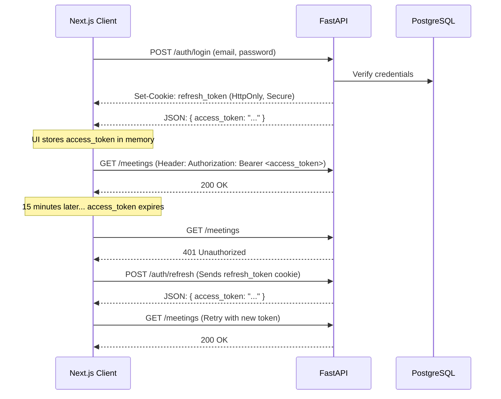

# MeetingMind — Authentication

MeetingMind utilizes a stateless, JWT-based authentication system designed to protect against XSS (via memory-only access tokens) and CSRF (via SameSite strict cookies).

## 1. Authentication Flow



## 2. Token Specifications

### Access Token
* **Format:** JWT signed with `HS256`.
* **Payload:** `sub` (User ID), `exp` (15 minutes from issue).
* **Storage (Client):** In-memory variable or React state. Never in `localStorage` or `sessionStorage`.
* **Transmission:** `Authorization: Bearer <token>` HTTP header.

### Refresh Token
* **Format:** Secure random string OR JWT with longer expiry.
* **Payload:** `sub` (User ID), `exp` (7 days from issue), `jti` (Unique token ID for revocation).
* **Storage (Client):** Stored by the browser via `Set-Cookie`.
* **Cookie Flags:** `HttpOnly=True`, `Secure=True` (in prod), `SameSite=Strict`.

## 3. Backend Implementation (FastAPI)

FastAPI handles token validation via dependency injection.

```python
from fastapi import Depends, HTTPException, status
from fastapi.security import OAuth2PasswordBearer
from jose import JWTError, jwt

oauth2_scheme = OAuth2PasswordBearer(tokenUrl="api/v1/auth/login")

async def get_current_user(token: str = Depends(oauth2_scheme)):
    credentials_exception = HTTPException(
        status_code=status.HTTP_401_UNAUTHORIZED,
        detail="Could not validate credentials",
        headers={"WWW-Authenticate": "Bearer"},
    )
    try:
        payload = jwt.decode(token, settings.SECRET_KEY, algorithms=["HS256"])
        user_id: str = payload.get("sub")
        if user_id is None:
            raise credentials_exception
    except JWTError:
        raise credentials_exception
        
    user = await get_user_by_id(user_id)
    if user is None:
        raise credentials_exception
    return user
```

## 4. Frontend Implementation (Next.js / Axios)

The frontend uses Axios interceptors to transparently handle token rotation when a 401 is received.

```typescript
import axios from 'axios';

const api = axios.create({ baseURL: '/api/v1' });

let accessToken = ''; // Stored in memory

// Inject token into requests
api.interceptors.request.use((config) => {
  if (accessToken) {
    config.headers.Authorization = `Bearer ${accessToken}`;
  }
  return config;
});

// Handle 401s and retry
api.interceptors.response.use(
  (response) => response,
  async (error) => {
    const originalRequest = error.config;
    if (error.response?.status === 401 && !originalRequest._retry) {
      originalRequest._retry = true;
      try {
        // The browser automatically attaches the HttpOnly refresh cookie
        const res = await axios.post('/api/v1/auth/refresh');
        accessToken = res.data.access_token;
        
        // Retry original request
        originalRequest.headers.Authorization = `Bearer ${accessToken}`;
        return api(originalRequest);
      } catch (refreshError) {
        // Refresh failed, redirect to login
        window.location.href = '/login';
        return Promise.reject(refreshError);
      }
    }
    return Promise.reject(error);
  }
);
```

## 5. Next.js Middleware Protection
For protecting Next.js frontend routes (pages), Middleware runs on the edge to verify the user is logged in before rendering the page. Since Middleware cannot access in-memory state, it looks for the `refresh_token` cookie as a proxy for "is the user likely authenticated?".

```typescript
// middleware.ts
import { NextResponse } from 'next/server'
import type { NextRequest } from 'next/server'

export function middleware(request: NextRequest) {
  const refreshToken = request.cookies.get('refresh_token')
  const isAuthRoute = request.nextUrl.pathname.startsWith('/login')

  if (!refreshToken && !isAuthRoute) {
    return NextResponse.redirect(new URL('/login', request.url))
  }
  
  if (refreshToken && isAuthRoute) {
    return NextResponse.redirect(new URL('/dashboard', request.url))
  }

  return NextResponse.next()
}

export const config = {
  matcher: ['/dashboard/:path*', '/meetings/:path*', '/login'],
}
```
