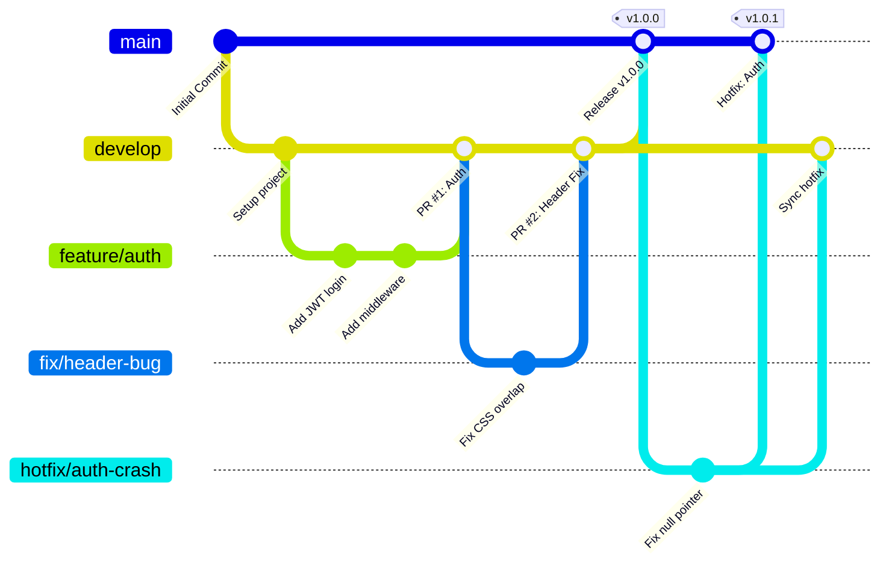

# MeetingMind — Branching Strategy

MeetingMind uses a modified **Git Flow** strategy tailored for continuous integration and staging environment validations before production deployment.

## 1. Branch Topology

## 2. Core Branches

| Branch | Purpose | Protection Rules | Deployment |
|---|---|---|---|
| `main` | Production-ready code. | Require PR. Require 2 approvals. CI must pass. No force push. | Auto-deploys to Production. |
| `develop` | Integration branch. Pre-production code. | Require PR. Require 1 approval. CI must pass. | Auto-deploys to Staging. |

## 3. Ephemeral Branches

All daily work happens on ephemeral branches branched off `develop`.

### 3.1 Feature Branches
* **Source:** `develop`
* **Target:** `develop`
* **Naming:** `feature/<ticket-id>-<short-desc>` (e.g., `feature/MM-142-transcript-viewer`)
* **Merge Strategy:** **Squash and Merge**. (Keeps the `develop` history clean).

### 3.2 Bugfix Branches
* **Source:** `develop`
* **Target:** `develop`
* **Naming:** `fix/<ticket-id>-<short-desc>` (e.g., `fix/MM-199-upload-timeout`)
* **Merge Strategy:** **Squash and Merge**.

### 3.3 Hotfix Branches
* **Source:** `main` (Only for urgent production issues).
* **Target:** `main` AND `develop` (must be synced back).
* **Naming:** `hotfix/<ticket-id>-<short-desc>`
* **Merge Strategy:** **Merge Commit**.

## 4. Pull Request Workflow

1. **Create Branch:** Create a feature branch from `develop`.
2. **Commit:** Write code and commit using Conventional Commits.
3. **Push & Open PR:** Push to remote and open a Pull Request against `develop`.
4. **CI Checks:** GitHub Actions will automatically run:
   * Linters (ESLint, Ruff)
   * Type Checkers (TSC, MyPy)
   * Unit Tests (Pytest, Vitest)
5. **Code Review:** A peer must review the code. All comments must be resolved.
6. **Merge:** Once approved and CI passes, the PR is Squash Merged into `develop`.

## 5. Release Process

1. When `develop` has accumulated enough features for a release, a Release Candidate (RC) is tested on the Staging environment.
2. A PR is opened from `develop` -> `main` with the title `chore: Release vX.Y.Z`.
3. The PR description contains the auto-generated Changelog.
4. Upon approval, the PR is merged into `main` using a **Merge Commit**.
5. A Git Tag (e.g., `v1.1.0`) is applied to the merge commit.
6. GitHub Actions detects the tag and triggers the production deployment pipeline.
