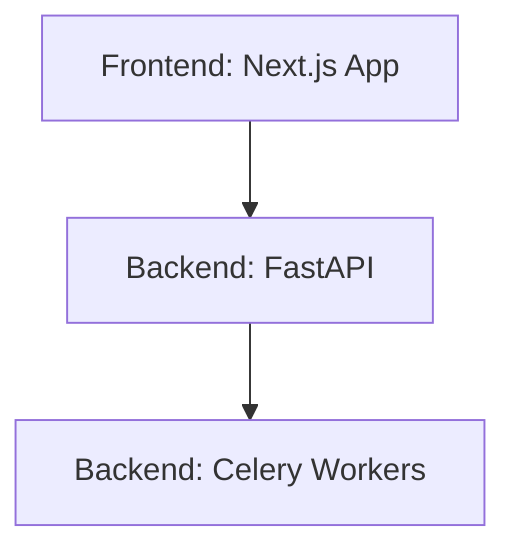

# MeetingMind — Folder Structure

This document outlines the directory architecture for both the Next.js Frontend and the FastAPI Backend. Strict adherence to this structure ensures predictability and maintainability as the codebase scales.

## 1. Architectural Layers



## 2. Frontend Structure (Next.js App Router)

The frontend uses a feature-sliced architecture combined with Next.js App Router conventions.

```text
frontend/
├── app/                  # Next.js App Router (Routes & Layouts)
│   ├── (auth)/           # Route group for auth pages
│   │   ├── login/page.tsx
│   │   └── register/page.tsx
│   ├── dashboard/        # Dashboard route
│   │   ├── page.tsx
│   │   └── layout.tsx
│   ├── layout.tsx        # Root layout
│   └── globals.css       # Global Tailwind CSS
├── components/           # Reusable UI Components
│   ├── ui/               # shadcn/ui primitives (Button, Input, Dialog)
│   ├── forms/            # Complex form assemblies
│   ├── layout/           # Sidebar, Topbar, AppShell
│   └── meeting/          # Feature-specific: TranscriptViewer, SummaryCard
├── lib/                  # Utilities and configurations
│   ├── api.ts            # Axios/Fetch instance setup
│   ├── utils.ts          # Tailwind merge utility (cn)
│   └── constants.ts      # Global constants
├── hooks/                # Custom React hooks
│   ├── use-meeting.ts
│   └── use-auth.ts
├── stores/               # Zustand state stores
│   ├── meeting-store.ts
│   └── ui-store.ts
├── types/                # Global TypeScript definitions
│   ├── api.types.ts
│   └── index.ts
└── public/               # Static assets (images, fonts, icons)
```

### Frontend Co-location Philosophy
* If a component is *only* used by `/app/dashboard/page.tsx`, it should be placed in `/app/dashboard/_components/` rather than the global `/components/` folder. Keep code as close to where it is used as possible.

## 3. Backend Structure (FastAPI)

The backend follows a domain-driven, layered architecture to cleanly separate routing, business logic, and database access.

```text
backend/
├── app/
│   ├── api/              # API Routing Layer
│   │   ├── dependencies.py # Reusable Depends() functions (Auth, DB)
│   │   ├── v1/           # API Version 1
│   │   │   ├── auth.py   # Auth routes
│   │   │   ├── meetings.py
│   │   │   └── search.py
│   │   └── router.py     # Main API router tying v1 together
│   ├── core/             # Application Core
│   │   ├── config.py     # Pydantic BaseSettings
│   │   ├── exceptions.py # Custom HTTP exceptions
│   │   ├── security.py   # JWT signing and password hashing
│   │   └── logging.py    # Loguru configuration
│   ├── db/               # Database Layer
│   │   ├── session.py    # SQLAlchemy engine/session setup
│   │   └── migrations/   # Alembic migrations folder
│   ├── models/           # SQLAlchemy ORM Models (Data layer)
│   │   ├── user.py
│   │   └── meeting.py
│   ├── schemas/          # Pydantic Models (Validation layer)
│   │   ├── user.py
│   │   └── meeting.py
│   ├── services/         # Business Logic Layer
│   │   ├── user_svc.py
│   │   ├── auth_svc.py
│   │   └── meeting_svc.py
│   ├── tasks/            # Celery Background Tasks
│   │   ├── worker.py     # Celery app initialization
│   │   └── audio_tasks.py
│   └── ai/               # AI & RAG Pipeline Layer
│       ├── prompts/      # LLM prompt templates
│       ├── whisper.py    # ASR interface
│       └── rag.py        # Langchain retrieval logic
├── tests/                # Pytest Suite
│   ├── conftest.py       # Test fixtures
│   ├── api/              # Route integration tests
│   └── services/         # Business logic unit tests
├── alembic.ini           # DB migration config
├── requirements.txt      # Python dependencies
└── main.py               # FastAPI application entry point
```

### Backend Layer Rules
1. **API Layer (`app/api`):** Only handles HTTP requests, dependency injection, and Pydantic validation. Must NOT contain direct SQLAlchemy queries. Calls the Service layer.
2. **Service Layer (`app/services`):** Contains the core business logic. Takes SQLAlchemy sessions as arguments. Returns ORM models or primitive types.
3. **Model Layer (`app/models`):** Only defines table structures. No logic.
4. **Task Layer (`app/tasks`):** Defines Celery `@task` functions. Tasks should generally delegate heavy lifting back to the Service layer or AI layer to keep the task definition thin.
