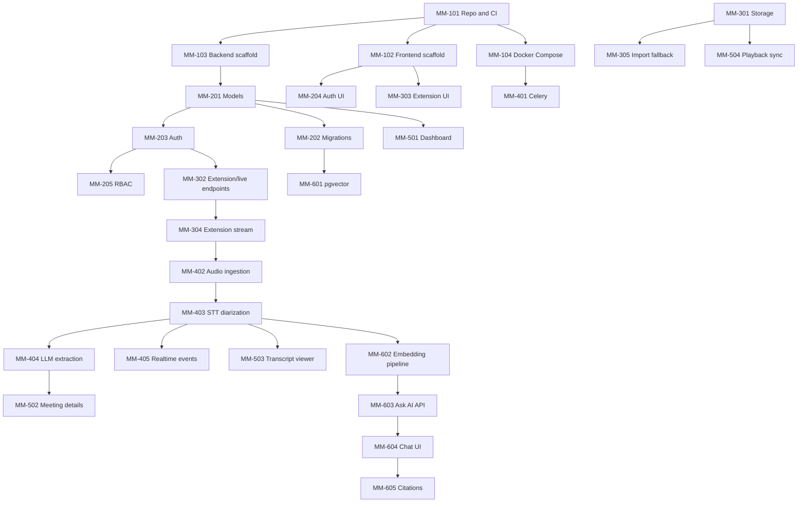

# MeetingMind: Jira Task Breakdown

This document expands the high-level Jira tickets into implementation-ready work. `02-engineering/jira-tickets.md` remains the backlog source of truth for ticket title, owner, points, description, and acceptance criteria. This file adds suggested subtasks, dependencies, verification, and handoff notes.

## Working Rules

- Start tickets in dependency order unless the team explicitly reprioritizes.
- Read the linked product, backend, design, and testing docs before implementation.
- Keep Chrome extension capture as the primary v1 flow.
- Treat recording import and standalone web capture as fallback/backfill paths.
- Keep external AI providers opt-in only; local Ollama/STT/embedding providers are the default.
- Every tenant-scoped API and database query must enforce workspace membership.

## Dependency Map

## Module 1: Project Foundation and DevOps

### MM-101: Scaffold GitHub Repo and CI/CD Actions

**Implementation subtasks**
- Create target monorepo folders: `apps/frontend`, `apps/backend`, `apps/extension`, `packages/` if shared code is needed later.
- Add root-level workspace scripts for lint, test, format, and typecheck.
- Add backend CI jobs for install, lint, typecheck, and pytest.
- Add frontend/extension CI jobs for install, lint, typecheck, and tests.
- Add dependency caching for Python and Node jobs.
- Add branch protection documentation for required checks.

**Dependencies:** None.

**Verification**
- Open a PR with a deliberate lint failure and confirm CI fails.
- Open a PR with a clean no-op change and confirm CI passes.
- CI must not require real AI models or external API keys.

### MM-102: Scaffold Next.js 15 Project and Design System

**Implementation subtasks**
- Initialize Next.js 15 App Router in `apps/frontend`.
- Configure TypeScript strict mode and path aliases.
- Install Tailwind CSS v4, shadcn/ui, Radix primitives, lucide-react, TanStack Query, and Zustand.
- Create semantic CSS variables for primary, background, card, border, muted, destructive, and success states.
- Add base layout with theme provider, app shell placeholder, and dark mode support.
- Install initial components: Button, Input, Card, Dialog, Dropdown, Toast.

**Dependencies:** MM-101.

**Verification**
- `npm run dev` starts on port 3000.
- `npm run lint` and `npm run typecheck` pass.
- Light and dark mode render without hardcoded color regressions.

### MM-103: Scaffold FastAPI and Poetry Environment

**Implementation subtasks**
- Initialize backend package in `apps/backend`.
- Configure Poetry or the selected Python dependency manager.
- Add FastAPI app factory, `/health`, and `/api/v1` router mounting.
- Add Pydantic settings for database, Redis, storage, JWT, and CORS.
- Add structured logging and request correlation ID middleware.
- Add lint/type tooling: ruff, mypy or pyright, pytest, pytest-asyncio.

**Dependencies:** MM-101.

**Verification**
- Uvicorn starts on port 8000.
- `/health` returns 200.
- `/docs` loads without import errors.
- Backend lint/type/test commands pass.

### MM-104: Create Local Docker Compose

**Implementation subtasks**
- Add local services for API, worker, PostgreSQL 16 with pgvector, Redis, and MinIO.
- Add local environment template without secrets.
- Configure service health checks and dependency ordering.
- Mount local volumes for PostgreSQL and MinIO data.
- Add seed or bootstrap instructions for local owner/admin user if needed.
- Document common commands for logs, migrations, tests, and reset.

**Dependencies:** MM-103 can run in parallel after MM-101.

**Verification**
- `docker compose up` starts all services.
- API connects to PostgreSQL and Redis.
- MinIO bucket is reachable from backend using local credentials.

## Module 2: Database and Authentication

### MM-201: Define SQLAlchemy Core Models

**Implementation subtasks**
- Create SQLAlchemy base model utilities with UUID primary keys and timestamps.
- Define `User`, `Workspace`, `WorkspaceMembership`, `Meeting`, `TranscriptSegment`, `ActionItem`, and `Decision`.
- Add workspace foreign keys to tenant-scoped tables.
- Model meeting source fields: `source_type`, `source_app`, `source_url`, `source_title`, visible participants, status, duration, retention flags.
- Add enum definitions for role, meeting status, source type, and processing status.
- Add indexes for workspace filtering, meeting status, created date, and transcript lookup.

**Dependencies:** MM-103.

**Verification**
- Model import test passes.
- Relationship tests cover workspace membership and meeting children.
- Transcript text is stored as timestamped segments, not one large blob.

### MM-202: Setup Alembic Migrations

**Implementation subtasks**
- Initialize Alembic in backend project.
- Wire Alembic to async SQLAlchemy metadata.
- Create first migration for core auth, workspace, meeting, transcript, action item, and decision tables.
- Add pgvector extension migration.
- Add downgrade paths where practical.
- Add local migration commands to README or DevOps docs.

**Dependencies:** MM-201.

**Verification**
- `alembic upgrade head` succeeds on a fresh database.
- `alembic downgrade -1` works where safe.
- Database schema matches documented tables.

### MM-203: Backend JWT Authentication Flow

**Implementation subtasks**
- Add password hashing service using bcrypt or argon2.
- Implement register, login, refresh, logout, and current-user endpoints.
- Store refresh tokens as HttpOnly cookies with secure settings for production.
- Add JWT signing, validation, expiry handling, and token revocation strategy.
- Add duplicate-email, invalid-credentials, and inactive-user handling.
- Add auth dependency for protected routes.

**Dependencies:** MM-201, MM-202.

**Verification**
- Unit tests cover password hashing and token validation.
- Integration tests cover register, login, refresh, logout, and unauthorized access.
- Cookies use secure settings in production config.

### MM-204: Frontend Auth UI and Session State

**Implementation subtasks**
- Build `/login` and `/register` pages with validated forms.
- Add auth API client with typed request/response contracts.
- Add session bootstrap flow for current user.
- Add protected route handling for dashboard and settings.
- Add error states for invalid credentials, network errors, and expired sessions.
- Add redirect behavior after login/logout.

**Dependencies:** MM-102, MM-203.

**Verification**
- Form validation tests pass.
- Successful login routes to dashboard.
- Expired or unauthenticated session routes to login.

### MM-205: Implement RBAC Middleware

**Implementation subtasks**
- Add workspace membership dependency for FastAPI routes.
- Support Owner/Admin/Member/Viewer role checks.
- Add helper APIs for `require_workspace_member` and `require_workspace_role`.
- Apply dependency to workspace, meeting, action item, transcript, extension, and AI endpoints.
- Add standardized 403 errors for missing workspace membership.
- Add test fixtures for users in different workspaces and roles.

**Dependencies:** MM-201, MM-203.

**Verification**
- Cross-workspace access returns 403.
- Valid workspace members can access allowed routes.
- Role-specific routes reject insufficient roles.

## Module 3: Chrome Extension Capture and Storage

### MM-301: Provision Object Storage and Realtime CORS

**Implementation subtasks**
- Create MinIO/S3 bucket configuration for imports, optional retained live audio, and exports.
- Add backend storage client abstraction.
- Add private bucket policy and presigned URL support.
- Configure CORS for frontend presigned PUT/GET flows.
- Add object key conventions scoped by workspace and meeting.
- Add retention policy configuration hooks.

**Dependencies:** MM-104.

**Verification**
- Presigned PUT succeeds from local frontend origin.
- Bucket objects are not publicly readable.
- Backend can generate and validate object keys.

### MM-302: Create Extension Connection and Live Session Endpoints

**Implementation subtasks**
- Implement `POST /extension/connect`.
- Issue short-lived extension tokens scoped to user and workspace.
- Implement `GET /extension/capabilities` and `POST /extension/heartbeat`.
- Implement `POST /workspaces/{workspace_id}/meetings/live`.
- Validate source app, URL, title, client type, participants, and workspace membership.
- Return meeting ID, stream URL, and stream token.

**Dependencies:** MM-203, MM-205, MM-201.

**Verification**
- Authenticated workspace member can connect extension.
- Non-member gets 403.
- Live session creates a meeting with status `recording`.
- Stream token expires and is scoped to one meeting.

### MM-303: Chrome Extension Capture UI

**Implementation subtasks**
- Create `apps/extension` Manifest V3 project.
- Build popup or side panel with authenticated, disconnected, unsupported page, ready, recording, paused, failed, and completed states.
- Detect Google Meet tabs by URL and page context.
- Show explicit Start Capture and Stop Capture controls.
- Request tab audio permission only after Start Capture.
- Render live status, elapsed time, and transcript snippets.
- Add accessible keyboard controls and visible error states.

**Dependencies:** MM-102, MM-302.

**Verification**
- Extension loads unpacked in Chrome.
- Google Meet tab shows capture-ready state.
- Unsupported pages show clear unavailable state.
- Start Capture triggers permission request and session creation.

### MM-304: Wire Extension Tab Audio Stream to Backend

**Implementation subtasks**
- Capture tab audio with Chrome extension APIs after user consent.
- Encode or normalize audio into supported chunk format.
- Open authenticated WebSocket/WebRTC stream using meeting stream token.
- Send 250-500ms chunks with sequence numbers and timestamps.
- Send visible meeting metadata when available.
- Handle transcript and AI events from backend.
- Add reconnect/recoverable error handling for network interruptions.

**Dependencies:** MM-302, MM-303, MM-402.

**Verification**
- Backend receives ordered audio chunks from extension.
- Connection loss shows recoverable UI state.
- Transcript interim/final events render in the extension.

### MM-305: Recording Import Fallback

**Implementation subtasks**
- Build import page or flow under `/meetings/import`.
- Add frontend file validation for MIME type, size, and extension.
- Request presigned import URL from backend.
- Upload file directly to object storage.
- Notify API when upload completes.
- Create or update meeting record with `recording_import` source type.
- Show progress, retry, success, and failed states.

**Dependencies:** MM-301, MM-205, MM-401.

**Verification**
- Valid MP3/MP4/WAV/M4A/WebM imports succeed up to 2 GB.
- Invalid file types fail before upload where possible.
- Backend also validates MIME and magic bytes.

### MM-306: Console Extension Settings

**Implementation subtasks**
- Build `/settings/extension`.
- Show extension connection status and last heartbeat.
- Let user choose default workspace for captures.
- Display supported apps and current rollout flags.
- Display raw audio retention policy.
- Provide install/open-extension guidance.
- Add disconnect/reset extension token action if supported.

**Dependencies:** MM-204, MM-302, MM-303.

**Verification**
- Settings page reflects backend capabilities.
- Workspace selection persists.
- Disconnected extension state is clear.

## Module 4: AI Pipeline

### MM-401: Setup Celery Infrastructure

**Implementation subtasks**
- Configure Celery app with Redis broker and result backend.
- Add worker entrypoint and queue names.
- Add dummy `ping` task and health check.
- Add retry, timeout, and idempotency conventions.
- Add task logging with meeting and workspace IDs.
- Add docker compose worker service.

**Dependencies:** MM-104, MM-103.

**Verification**
- Worker boots and registers tasks.
- `ping` task executes locally.
- Failed tasks are logged clearly.

### MM-402: Streaming Audio Ingestion Task

**Implementation subtasks**
- Implement WebSocket receive loop for authenticated meeting streams.
- Validate stream token, workspace, meeting status, and chunk metadata.
- Normalize incoming audio into STT-compatible format.
- Track sequence numbers and recover or reject invalid chunks.
- Buffer chunks safely without unbounded memory growth.
- Publish ingestion status events.

**Dependencies:** MM-302, MM-304, MM-401.

**Verification**
- Invalid token is rejected.
- Out-of-order chunks do not corrupt transcript state.
- Long meeting stream does not leak memory.

### MM-403: Transcription and Diarization Task

**Implementation subtasks**
- Integrate local streaming STT provider.
- Emit interim transcript events for low-latency UI.
- Persist final transcript segments with timestamps.
- Add online diarization or speaker label fallback.
- Map transcript segments to meeting/workspace safely.
- Add batch import transcription path using the same segment model.

**Dependencies:** MM-402, MM-201.

**Verification**
- Sample audio produces final transcript segments.
- Speaker labels persist when available.
- Import and live capture write compatible transcript records.

### MM-404: LLM Summarization Task

**Implementation subtasks**
- Add Ollama client abstraction.
- Build prompt templates for summary, action items, and decisions.
- Use structured JSON output and validation.
- Store summary/action/decision data with citations to transcript segments.
- Add retry handling for malformed LLM output.
- Add rolling summary updates during live capture.

**Dependencies:** MM-403.

**Verification**
- Mocked LLM output creates valid action items and decisions.
- Invalid JSON is handled without losing transcript data.
- Citations link back to transcript segment IDs or timestamps.

### MM-405: Real-Time Pipeline Events

**Implementation subtasks**
- Define event schema for status, transcript, action item, summary, error, and completion events.
- Implement event publisher from backend pipeline.
- Add WebSocket delivery to active extension and console clients.
- Add fallback polling for non-active views.
- Add reconnection behavior and missed-event recovery.
- Add frontend state mapping for `recording`, `transcribing`, `analyzing`, `completed`, and `failed`.

**Dependencies:** MM-402, MM-403, MM-404, MM-303.

**Verification**
- Active meeting UI updates without manual refresh.
- Reconnected client receives current status.
- Failed pipeline emits readable error state.

## Module 5: Core Application UI

### MM-501: Dashboard Meeting List

**Implementation subtasks**
- Build dashboard route and meeting list query.
- Render recent captured/imported meetings as cards.
- Show source app, status, title, date, duration, and creator.
- Add empty state with primary Connect Extension CTA and secondary Import Recording CTA.
- Add loading, error, and no-results states.
- Add cursor pagination or load-more behavior where needed.

**Dependencies:** MM-102, MM-205, MM-302.

**Verification**
- Empty workspace shows correct extension-first CTA.
- Meeting cards route to details.
- Loading and error states are accessible.

### MM-502: Meeting Details and Summary View

**Implementation subtasks**
- Build meeting details route.
- Fetch meeting, summary, action items, decisions, and source metadata.
- Render summary with cited sections where available.
- Render editable/checkable action items.
- Render decisions with rationale and timestamps.
- Show processing and failed states.

**Dependencies:** MM-404, MM-501.

**Verification**
- Completed meeting shows summary and actions.
- Processing meeting updates status.
- Action item completion persists after refresh.

### MM-503: Interactive Transcript Viewer

**Implementation subtasks**
- Build transcript segment list with virtualization.
- Render speaker chips, timestamps, final/interim distinction, and active segment state.
- Support speaker rename flow if backend supports it.
- Add search within transcript.
- Add citation jump target support.
- Handle 3-hour meeting without DOM lag.

**Dependencies:** MM-403, MM-502.

**Verification**
- Large transcript scrolls smoothly.
- Citation links jump to correct segment.
- Speaker labels remain readable on mobile.

### MM-504: Video Playback and Timestamp Sync

**Implementation subtasks**
- Add media player for retained live audio/video or imported recording where available.
- Use signed media URLs instead of public object URLs.
- Seek media when transcript timestamp is clicked.
- Highlight active transcript segment while media plays.
- Handle missing retained media gracefully.
- Respect retention policy and user permissions.

**Dependencies:** MM-301, MM-503.

**Verification**
- Clicking timestamp seeks accurately.
- Expired signed URL refreshes or shows clear error.
- Meeting without retained media still shows transcript and summary.

## Module 6: RAG Search and Ask AI

### MM-601: Setup pgvector and Indexes

**Implementation subtasks**
- Enable pgvector extension in migration.
- Add `embedding vector(768)` column to transcript segments or a dedicated transcript chunk table.
- Add HNSW cosine index.
- Add workspace/meeting filters for vector search.
- Add migration tests or schema assertions.

**Dependencies:** MM-202.

**Verification**
- Migration creates pgvector extension and vector column.
- HNSW index exists.
- Query plan uses workspace filter before or with vector search where practical.

### MM-602: Vector Embedding Pipeline Step

**Implementation subtasks**
- Chunk finalized transcript text into retrieval-friendly units.
- Generate embeddings using the default local BGE provider.
- Persist vectors with transcript segment references and workspace ID.
- Add idempotent re-embedding behavior.
- Add batch backfill task for imported or existing meetings.
- Add failure handling and retry strategy.

**Dependencies:** MM-403, MM-601.

**Verification**
- Mock embedding provider writes 768-dimensional vectors.
- Re-running embedding task does not create duplicates.
- Missing transcript segments are skipped or reported safely.

### MM-603: POST /ai/chat Endpoint

**Implementation subtasks**
- Add request/response schemas for workspace-scoped chat.
- Embed user query with local embedding provider.
- Retrieve top transcript chunks with workspace filter.
- Build prompt with cited context only.
- Stream or return answer from local LLM.
- Include citations that map to meeting and transcript timestamps.
- Reject questions without enough meeting context.

**Dependencies:** MM-602, MM-404, MM-205.

**Verification**
- Cross-workspace retrieval is impossible.
- Known-context questions return cited answers.
- Out-of-context questions are refused or clearly bounded.

### MM-604: Chat Interface UI

**Implementation subtasks**
- Build Ask AI route or panel.
- Add message list with user and assistant bubbles.
- Add sticky input with loading/streaming state.
- Render Markdown safely.
- Render empty state and example prompts based on captured/imported meetings.
- Add keyboard submit and accessible focus handling.

**Dependencies:** MM-102, MM-603.

**Verification**
- Chat works on desktop and mobile.
- Streaming/loading state is clear.
- Markdown rendering is sanitized.

### MM-605: Chat API Integration and Citations

**Implementation subtasks**
- Connect chat UI to `POST /ai/chat`.
- Support streaming response if backend enables SSE/WebSocket streaming.
- Render citation chips with meeting title and timestamp.
- On citation click, route to meeting details and jump to transcript segment.
- Preserve chat error states for rate limits, empty corpus, and backend failure.
- Add analytics events only if local/opt-in telemetry supports them.

**Dependencies:** MM-603, MM-604, MM-503.

**Verification**
- Citation click opens correct meeting and timestamp.
- Empty workspace returns helpful state.
- API errors do not lose typed input.

## Cross-Cutting Definition of Done

Every ticket should satisfy:

- Acceptance criteria in `02-engineering/jira-tickets.md`.
- Relevant unit/integration/component tests.
- Workspace authorization for all tenant-scoped behavior.
- No committed secrets or real API keys.
- Local-first AI behavior unless explicit opt-in is part of the ticket.
- Clear loading, empty, error, and success states for user-facing work.
- Documentation updates when behavior or architecture changes.

