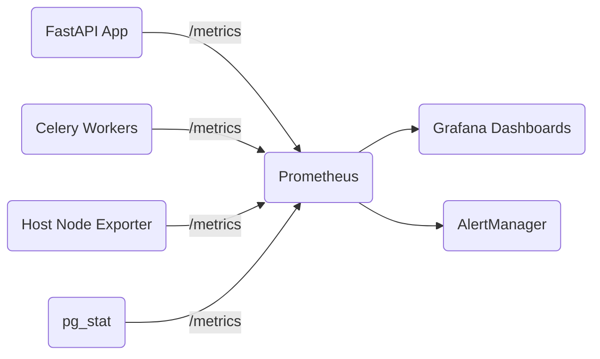

# MeetingMind — Monitoring & Telemetry

Because MeetingMind is primarily self-hosted, monitoring relies on providing administrators with local observability tools (Prometheus + Grafana) rather than transmitting telemetry to a central SaaS dashboard.

## 1. Metrics Architecture



## 2. FastAPI Metrics (Prometheus)

We use the `prometheus_client` library and the `prometheus-fastapi-instrumentator` package to expose a `/metrics` endpoint.

**Key Metrics Tracked:**
* `http_requests_total`: Counter (labeled by method, path, status).
* `http_request_duration_seconds`: Histogram (labeled by path) to calculate p95 latency.
* `meetingmind_db_connection_pool`: Gauge of active SQLAlchemy connections.

```python
from prometheus_fastapi_instrumentator import Instrumentator

instrumentator = Instrumentator(
    should_group_status_codes=False,
    should_ignore_untemplated=True,
    should_instrument_requests_inprogress=True,
)
instrumentator.instrument(app).expose(app, include_in_schema=False)
```

## 3. Celery & AI Worker Metrics

Monitoring the background queue is critical. If workers crash, meetings get stuck in the "Queued" state indefinitely.

**Key Metrics Tracked (via `celery-exporter`):**
* `celery_tasks_total`: Counter of tasks (labeled by state: SUCCESS, FAILURE, RETRY).
* `celery_queue_length`: Gauge of tasks waiting to be processed.
* `meetingmind_whisper_duration_seconds`: Custom histogram tracking ASR execution time.
* `meetingmind_llm_duration_seconds`: Custom histogram tracking local LLM inference time.

## 4. Hardware Monitoring

Since MeetingMind runs heavy local AI models, host hardware metrics are essential.
* **Node Exporter:** Captures CPU, RAM, and Disk I/O.
* **NVIDIA DCGM Exporter:** If deployed with GPUs, this exporter tracks VRAM usage, GPU utilization, and temperature to ensure Ollama/Whisper aren't thermal throttling.

## 5. Pre-Packaged Grafana Dashboards

The MeetingMind Docker Compose stack includes Grafana pre-provisioned with three dashboards:

1. **System Health:** CPU, RAM, Disk, GPU utilization.
2. **API Performance:** Requests per second (RPS), p95 latency, 4xx/5xx error rates.
3. **AI Pipeline:** Celery queue lengths, transcription times, LLM inference times, and task failure rates.

## 6. Alerting Rules (AlertManager)

Administrators can configure AlertManager to send webhooks, Slack messages, or emails when critical thresholds are breached. Default rules included in the repository:

* **HighErrorRate:** Alert if 5xx errors > 1% of total requests for 5 minutes.
* **QueueBackedUp:** Alert if Celery queue length > 20 for 15 minutes.
* **StorageWarning:** Alert if MinIO volume usage > 85%.
* **ApiDown:** Alert if Prometheus cannot scrape the FastAPI `/metrics` endpoint for 3 consecutive minutes.
