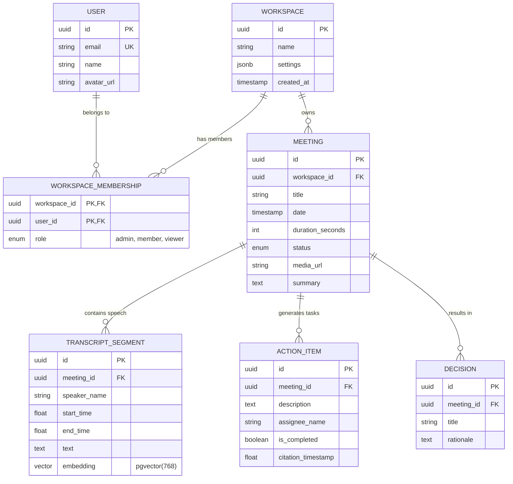

# MeetingMind Backend: ER Diagram

## 1. Overview
This document provides a visual representation of the MeetingMind PostgreSQL database schema using Mermaid.js.

## 2. Diagram Philosophy
The ER diagram focuses on logical relationships. It abstracts away audit fields (like `created_at`, `updated_at`) unless they are critical for business logic, prioritizing foreign key relationships and multiplicity.

## 3. Mermaid ER Diagram

## 4. Key Relationships Explained

### 4.1 Workspace Core
The `WORKSPACE` is the root of the data graph. Data must not leak between workspaces. The many-to-many relationship between `USER` and `WORKSPACE` is resolved through `WORKSPACE_MEMBERSHIP`, which also carries the RBAC (Role-Based Access Control) payload (`role`).

### 4.2 Meeting Hierarchy
A `MEETING` acts as the aggregate root for all generated AI data.
* If a `MEETING` is deleted, its `TRANSCRIPT_SEGMENT`s, `ACTION_ITEM`s, and `DECISION`s should cascade delete.

### 4.3 The Embedding Vector
The `TRANSCRIPT_SEGMENT` contains the `vector` column. This means RAG queries will return specific segments of a meeting, allowing the UI to link directly to the `start_time` of the relevant audio clip.

## 5. Notes for Implementation
* Ensure `ON DELETE CASCADE` is set on the foreign keys pointing to `MEETING`.
* In SQLAlchemy, configure back-populates to allow eager loading of action items when fetching a meeting.
