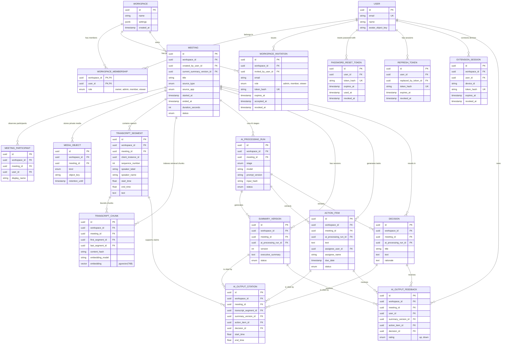

# MeetingMind Backend: ER Diagram

## 1. Overview
This document provides a visual representation of the MeetingMind PostgreSQL database schema using Mermaid.js.

## 2. Diagram Philosophy
The ER diagram focuses on logical relationships. It abstracts away audit fields (like `created_at`, `updated_at`) unless they are critical for business logic, prioritizing foreign key relationships and multiplicity.

## 3. Mermaid ER Diagram

## 4. Key Relationships Explained

### 4.1 Workspace Core
The `WORKSPACE` is the root of the data graph. Data must not leak between workspaces. The many-to-many relationship between `USER` and `WORKSPACE` is resolved through `WORKSPACE_MEMBERSHIP`, which also carries the RBAC (Role-Based Access Control) payload (`role`).

In v1, the deployment exposes one active default workspace per ADR 010. Pending invitations do not grant access; a membership is created only when invitation registration succeeds. Invitation and password-reset tokens are stored only as hashes.

### 4.2 Meeting Hierarchy
A `MEETING` acts as the aggregate root for all generated AI data.
* It owns participants, private media-object keys, immutable transcript source segments, retrieval chunks, processing runs, versioned summaries, action items, decisions, and their citations.
* Normal reads exclude a soft-deleted Meeting. Hard deletion cascades meeting-owned records only after the retention window.

### 4.3 The Embedding Vector
`TRANSCRIPT_CHUNK` contains the `vector(768)` column and references its first/last source segments. Retrieval returns chunks, while citations resolve back to exact immutable `TRANSCRIPT_SEGMENT` rows and timestamps.

## 5. Notes for Implementation
* Follow `04-backend/data-dictionary.md` for fields, check constraints, direct workspace IDs, delete behavior, and required indexes.
* `AI_OUTPUT_CITATION` must reference exactly one output type and all related rows must share workspace and meeting.
