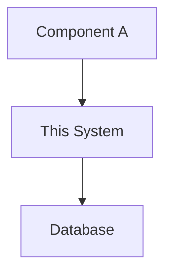

# MeetingMind Architecture: [System/Module Name]

## 1. Overview
[High-level summary of the architectural sub-system.]

## 2. Business Justification
[Why does this system exist? What business value does it provide?]

## 3. Technology Choices
[List the specific databases, languages, frameworks, or cloud services used.]

## 4. System Context Diagram
[Mermaid JS diagram showing how this module fits into the larger MeetingMind ecosystem.]

## 5. Core Data Flows
[Describe step-by-step how data moves through this system.]
1. Step One.
2. Step Two.

## 6. Component Deep Dive
[Detailed breakdown of the internal components of this system.]

## 7. Data Storage & Schema
[How does this system persist state?]

## 8. Scalability & Performance
[How does this system scale under load? What are its bottlenecks?]

## 9. Resilience & Error Handling
[What happens if a dependency goes down? How does the system recover?]

## 10. Security & Compliance
[Data privacy, encryption, access controls.]

## 11. Monitoring & Observability
[Key metrics to track in Grafana/DataDog.]

## 12. Alternatives Considered
[What other architectures were evaluated and why were they rejected?]
