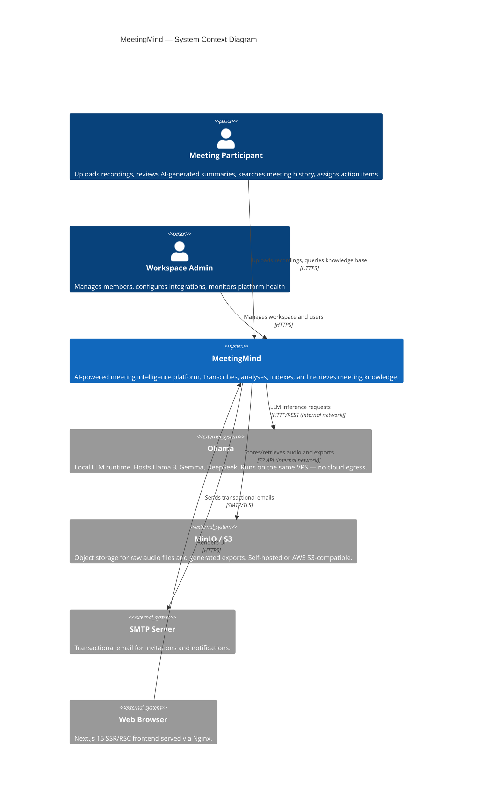

# MeetingMind

[](https://github.com/meetingmind/meetingmind/actions)
[](CHANGELOG.md)
[](LICENSE)
[](https://www.typescriptlang.org/)
[](https://www.python.org/)
[](https://nextjs.org/)
[](https://fastapi.tiangolo.com/)
[](https://docs.docker.com/compose/)
[](https://www.w3.org/WAI/WCAG22/quickref/)

> **An AI-powered meeting intelligence platform that transforms raw audio recordings into structured, searchable, and actionable organizational knowledge — entirely self-hosted.**

MeetingMind ingests meeting recordings, transcribes speech using OpenAI Whisper, extracts structured insights (summaries, action items, decisions, topics) via local Large Language Models through Ollama, and indexes everything into a pgvector-backed knowledge base for semantic search and RAG-powered Q&A — all without sending data to third-party cloud AI providers.

---

## Table of Contents

- [Key Features](#key-features)
- [Architecture](#architecture)
- [Tech Stack](#tech-stack)
- [Quick Start](#quick-start)
- [Documentation Index](#documentation-index)
- [Contributing](#contributing)
- [License](#license)

---

## Key Features

| Feature | Description |
|---|---|
| 🎙️ **AI Transcription** | Whisper-powered speech-to-text with speaker diarization and timestamp alignment |
| 🧠 **Structured Extraction** | LLM-driven extraction of summaries, action items, decisions, and topics via local Ollama models |
| 🔍 **Semantic Search** | Hybrid BM25 + pgvector cosine similarity search across all meeting content |
| 💬 **RAG Q&A** | Ask natural language questions; answers are grounded in your meeting corpus with citations |
| 🗂️ **Workspace Isolation** | Multi-tenant workspaces with RBAC — members see only what they should |
| 🔒 **Data Sovereignty** | All AI inference runs locally (Ollama); no audio or text leaves your infrastructure |
| 📤 **Export** | One-click export to PDF, Markdown, and DOCX formats |
| 🌗 **Light / Dark Themes** | WCAG 2.2 AA compliant UI with system-preference detection |
| ⚡ **Async Processing** | Celery + Redis task queue for non-blocking, resumable audio processing |
| 🐳 **Docker-First** | Single `docker compose up` deployment with Nginx reverse proxy |

---

## Architecture

The following C4 Context diagram illustrates how MeetingMind sits within its environment:



> See [00-project/architecture-overview.md](00-project/architecture-overview.md) for the full C4 Level 1–2 breakdown, data flow diagrams, and deployment topology.

---

## Tech Stack

### Frontend

| Layer | Technology | Rationale |
|---|---|---|
| Framework | Next.js 15 (App Router) | RSC for zero-bundle server components, streaming SSR, built-in image optimization |
| UI Runtime | React 19 | Concurrent rendering, `useTransition`, `useOptimistic` for snappy UX |
| Language | TypeScript 5.x | End-to-end type safety, better IDE DX, prevents runtime contract violations |
| Styling | Tailwind CSS v4 | Utility-first, CSS custom property tokens, JIT compilation |
| Component Library | shadcn/ui + Radix UI | Unstyled accessible primitives; full ownership of component source |
| Animation | Framer Motion | Declarative, physics-based animations; respects `prefers-reduced-motion` |
| Typography | Outfit (Google Fonts) | Geometric sans-serif; high legibility at small sizes |

### Backend

| Layer | Technology | Rationale |
|---|---|---|
| API Framework | FastAPI 0.111 | Async-first, Pydantic v2 validation, automatic OpenAPI docs, high throughput |
| Language | Python 3.11+ | `asyncio` improvements, `tomllib`, match statements, `Self` type annotation |
| Task Queue | Celery + Redis | Durable async processing; retries, ETA scheduling, priority queues |
| Database | PostgreSQL 16 + pgvector | ACID transactions + native vector similarity search in one RDBMS |
| Cache / Broker | Redis 7 | Sub-millisecond reads, pub/sub for real-time updates, Celery broker |
| Object Storage | MinIO (S3-compatible) | Self-hosted; presigned URL delivery; S3 API drop-in for cloud migration |

### AI / ML

| Component | Technology | Rationale |
|---|---|---|
| Transcription | OpenAI Whisper (large-v3) | State-of-the-art WER; runs locally via faster-whisper |
| LLM Inference | Ollama (Llama 3 / Gemma / DeepSeek) | Local inference; model hot-swap; no data egress |
| Embeddings | BAAI BGE-M3 | Multilingual; 1024-dim; top MTEB leaderboard for retrieval |
| RAG Orchestration | LangChain | Retrieval chains, prompt templates, output parsers |
| Vector Index | pgvector HNSW | Approximate nearest-neighbour search at scale; native Postgres |

### Infrastructure

| Component | Technology | Rationale |
|---|---|---|
| Containerisation | Docker + Docker Compose | Reproducible environments; service isolation; single-command startup |
| Reverse Proxy | Nginx | TLS termination, static file caching, upstream load balancing |
| CI/CD | GitHub Actions | Automated lint, type-check, test, build, and deploy pipelines |
| Secrets | `.env` + Docker secrets | Environment-level secrets; never committed to VCS |

---

## Quick Start

### Prerequisites

- [Docker Engine >= 24.0](https://docs.docker.com/engine/install/)
- [Docker Compose >= 2.20](https://docs.docker.com/compose/install/)
- [Ollama](https://ollama.com/download) installed and accessible (can run on the same host)
- At least **16 GB RAM** and **20 GB disk** recommended for local LLM inference

### Step 1 — Clone the Repository

```bash
git clone https://github.com/meetingmind/meetingmind.git
cd meetingmind
```

### Step 2 — Configure Environment Variables

```bash
cp .env.example .env
```

Open `.env` and set the required values:

```dotenv
# ── Application ──────────────────────────────────────────
APP_SECRET_KEY=<generate with: openssl rand -hex 32>
FRONTEND_URL=http://localhost:3000

# ── Database ──────────────────────────────────────────────
POSTGRES_USER=meetingmind
POSTGRES_PASSWORD=<strong-password>
POSTGRES_DB=meetingmind

# ── Redis ─────────────────────────────────────────────────
REDIS_URL=redis://redis:6379/0

# ── MinIO ─────────────────────────────────────────────────
MINIO_ROOT_USER=minioadmin
MINIO_ROOT_PASSWORD=<strong-password>
MINIO_ENDPOINT=http://minio:9000

# ── Ollama ────────────────────────────────────────────────
OLLAMA_BASE_URL=http://host.docker.internal:11434
OLLAMA_DEFAULT_MODEL=llama3

# ── Email ─────────────────────────────────────────────────
SMTP_HOST=smtp.example.com
SMTP_PORT=587
SMTP_USER=no-reply@example.com
SMTP_PASSWORD=<smtp-password>
```

### Step 3 — Pull Required Ollama Models

```bash
ollama pull llama3
ollama pull nomic-embed-text   # lightweight embedding model alternative
```

### Step 4 — Start All Services

```bash
docker compose up -d
```

This starts: `frontend`, `backend`, `worker`, `postgres`, `redis`, `minio`, `nginx`.

Check service health:

```bash
docker compose ps
docker compose logs -f backend worker
```

### Step 5 — Access MeetingMind

| Service | URL |
|---|---|
| **Web Application** | http://localhost:3000 |
| **API Documentation** | http://localhost:8000/docs |
| **MinIO Console** | http://localhost:9001 |
| **Flower (Celery Monitor)** | http://localhost:5555 |

On first boot, database migrations run automatically and a default admin user is seeded. See the console logs for the initial credentials.

> **Production deployment:** See [docs/deployment/](docs/deployment/) for Nginx + TLS, Traefik, and VPS hardening guides.

---

## Documentation Index

| Document | Description |
|---|---|
| [00-project/product-overview.md](00-project/product-overview.md) | Executive summary, capability map, user segments, competitive positioning |
| [00-project/architecture-overview.md](00-project/architecture-overview.md) | System context, container, data flow, and deployment diagrams |
| [00-project/glossary.md](00-project/glossary.md) | 70+ definitions for AI/ML, product, and technical terms |
| [00-project/roadmap.md](00-project/roadmap.md) | Versioned feature roadmap with Gantt chart through v2.0.0 |
| [00-project/success-metrics.md](00-project/success-metrics.md) | Engineering, product, AI quality, and business KPIs with targets |
| [CONTRIBUTING.md](CONTRIBUTING.md) | Branch naming, PR process, coding standards, commit format |
| [CHANGELOG.md](CHANGELOG.md) | Keep-a-Changelog versioned release history |

---

## Contributing

We welcome contributions from the community. Please read [CONTRIBUTING.md](CONTRIBUTING.md) before opening a pull request. Key points:

- Follow [Conventional Commits](https://www.conventionalcommits.org/) for all commit messages
- Run `pnpm test` and `pytest` before pushing
- All PRs require at least one approved code review
- TypeScript `strict` mode and Python `mypy --strict` are enforced in CI

---

## License

MeetingMind is released under the [MIT License](LICENSE).

© 2026 MeetingMind Engineering Team. All rights reserved.
